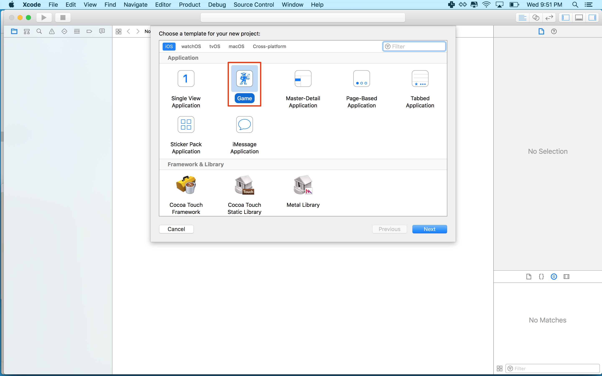

If you have never built a side scroller before, this introduction will help you understand the basic concepts. You will be tackling this by constructing an obstacle treadmill.  The player effectively flies on the spot and must navigate the obstacles coming towards them by moving up or down.

You will learn to implement the following:

- A physics controlled bunny
- Dynamic obstacle object generation and removal
- Animation and actions
- World scrolling
- Implement physics based collision detection
- Create your own custom button class

# Create a new project

Time to make a SpriteKit project in Xcode and get started with Hoppy Bunny!

> [action]
> Your first step is to create a new SpriteKit Xcode project, open Xcode and select `Create a new Xcode project`. Then select `iOS > Application > Game` as shown below:
>
> 
>
> On the next screen, Give your product a name (i.e. "hoppy-bunny"), and make sure you select `Spritekit` as the Game Technology

## Adding artwork

> [action]
> After the project is created, you should [download our art pack for this game](https://github.com/MakeSchool-Tutorials/Hoppy-Bunny-SpriteKit-Swift3-V2/raw/master/assets.zip).
> Next you will add the art pack you just downloaded to your Xcode project by first unpacking the archive.
> Select the `Assets.xcassets` folder in Xcode project navigator, then drag the downloaded assets into Xcode as shown below:
>
> 

## Asset Scale

This would be good time to touch on the subject of asset scale. You may have noticed when you select an asset in **Assets.xcassets** you are presented with *1x 2x 3x Scale* options and by default they will be set to *1x Scale* as the filename contains no implied scale e.g. `@2x` or `@3x`

Have a look at this handy [Device resolution guide](http://www.paintcodeapp.com/news/ultimate-guide-to-iphone-resolutions)

In particular look at the *Rendered Pixels* section and notice the reference to scale factor.  These assets were designed for retina 2x resolution devices.

> [action]
> Ensure you have the *Assets.xcassets* selected in the *Project Navigator* and then select each asset file and drag them from *1x* to *2x*.

# Summary

Great, you've setup a basic project and added the artwork! In the next section it's time to start building our game.
