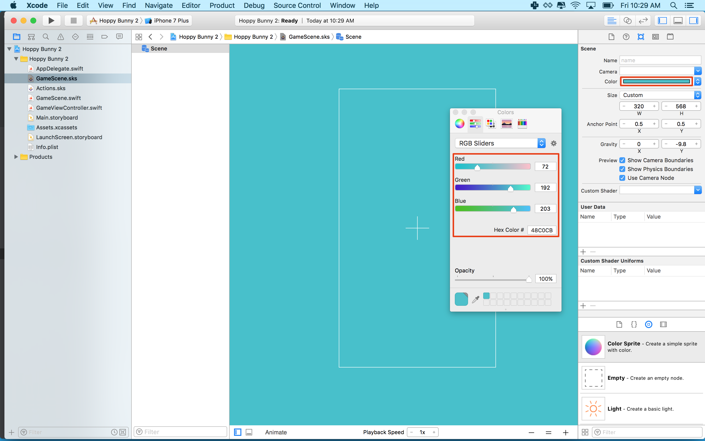
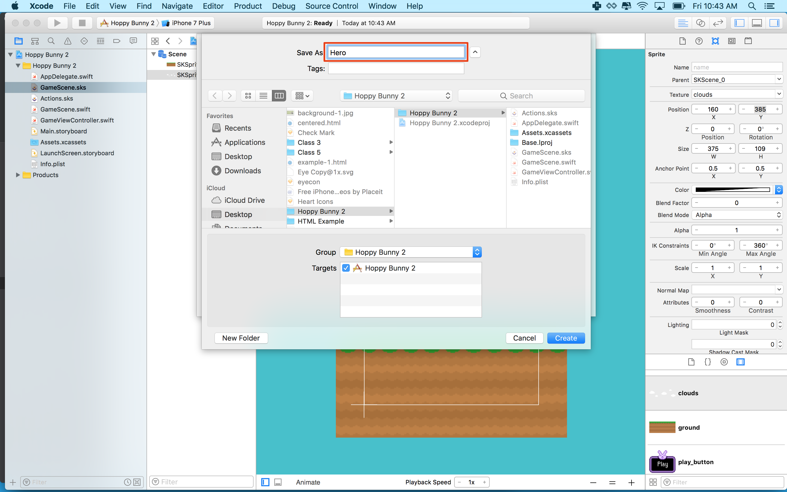

Let's get started setting up the main game scene, SpritKit Scene Editor is a
powerful Xcode tool that lets you rapidly layout the scene.

# Setting the stage

> [action] Select `GameScene.sks` from the _Project navigator_:
>
> It's helpful to see the scene size, zoom out so you can see the white border
> which represents the scene size. Select `Editor / Zoom Out` or use the
> shortcut shown.
>
> The default project may have a Label in the center with the Text "Hello
> World". Click it to select it and press `delete` on the keyboard.
>
> Next modify the size parameters as shown in the _Attributes inspector panel_
> set width to 320 and height to 568 `(width: 320, height: 568)`
>
> 

Remember the device resolution guide in the previous chapter? You will be using
a common design size of 320 x 568, this gives you a nice portrait view,
perfectly suited to the artwork. You may be wondering what about supporting
other devices?

Thankfully SpriteKit has your back and can automatically scale the view to fit
other devices. This size will scale to fit iPhone 4, 5, 6, and 7.

> [info] Have a look through the code in `GameViewController.swift`. In
> particular:

```
/* Set the scale mode to scale to fit the window */
>
scene.scaleMode = .aspectFill
```

> If you `option+click` _scaleMode_ and look at the _Quick Help inspector_ panel
> you can find out more about the scaling options available.

## Move the center to the lower left

To make it easier to position objects on the screen you will move the center
point of the scene to the lower left.

> [action] Set Anchor Point of both x and y to 0.
>
> 

## Set the Background Color

Wow that last image had a blue background! How did that happen?!

Let's do it ourselves!

> [action] With `GameScene.sks` set the color by clicking the color selector
> near the top of the property inspector. Set the color to a nice sky blue. You
> can use your own color or use (red: 72, green: 192, blue: 203).
>
> 

## Add the ground image

> [action] Open the media library by clicking the small Plus button in the upper
> right.  Scroll through
> the media library and drag _ground.png_ into the scene.
>
> 
>
> Set the position to `(160,32)` or anywhere you think looks good, it's your
> game after all.
>
> 
>
> You'll notice the ground image extends beyond the screen border. Don't worry
> about it, you will be scrolling the ground later to create that endless runner
> effect.

## Add the clouds

> [action] Drag in _clouds.png_ to the scene Set the _Position_ to `(160, 385)`
> or any other value you think looks good.
>
> 

# Creating the Bunny Scene

Now you're going to create a new _SpriteKit Scene File_ for the bunny and
animate it.

> [action] Create a new _SpriteKit Scene File_ by selecting
> `File > New > File > SpriteKit Scene`:
>
> 
>
> Because bunnies are heroes, save the file as `Hero.sks`
>
> 

## Add the bunny

> [action] Select `Hero.sks` in the _Project navigator_
>
> Drag `bunny1.png` into scene.
>
> You may not be able to see the bunny, if not `Zoom Out` the scene, center your
> view on the bunny and then `Zoom In` a little.
>
> You will be connecting the bunny in code later so you need a way to reference
> it. This is typically done using the _Name_ property, so set _Name_ to `hero`.
> Make sure you also set the _Position_ to `(0, 0)`, _Size_ to `(33, 33)`, and
> set the _Anchor Point_ to `(0.5, 0.5)`
>
> 

<!--  -->

> [info] Personally I dislike using the huge default scene size, when only
> dealing with a single asset. It can also cause unexpected position issues
> later on when using it as a referenced object. Why did we set the _Size_ to
> `(33, 33)`? This is the _Size_ of the _bunny_ sprite!

## Animating the bunny

Great, you have a static bunny. However, we want this bunny to fly, and the
bunny can fly by flapping its ears! You are going to set up a sprite frame based
animation that is ~`0.5` seconds long and repeats forever.

> [action] Open _Hero.sks_, open the Timeline if it is not open already. Look
> for this icon in the bottom left of your editor area.
> 
>
> Next open the _Object library_ panel
>  and look for the
> _AnimateWithTextures Action_
>
> 
>
> and drag this into the start of the bunny _Timeline_ as shown:
>
> 
>
> Set the _Duration_ to `0.5`, feel free to have a play with this value.
>
> Time to add the animation frames, click on the _AnimateWithTextures Action_ in
> the _Timeline_ then open the _Media library_ panel (use that `+` button!).
> Drag `bunny1.png` and `bunny2.png` into the _Textures_ box as shown:
>
> 
>
> Before we try the animation, let's make it loop. Click on the _Circular arrow_
> in the bottom left of your _AnimateWithTextures Action_ as shown and click the
> `Infinity` symbol.
>
> 
>
> 
>
> Finally time to see the bunny in action! Click _Animate_ in the _Timeline_ and
> watch that bunny go.
>
> 

# Summary

The game is already starting to take shape, you learned to:

- Build the layout for your game scene using the SpriteKit Scene Editor.
- Create the hero of the game as a stand alone SpriteKit Scene
- Used the timeline and added your first action
- Added a sprite frame animation to bring the bunny to life

In the next chapter you will be adding physics to the game world.
