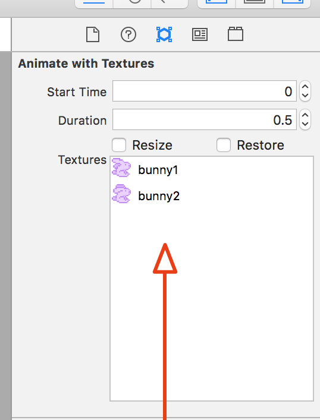

Let's get started setting up the main game scene, SpritKit Scene Editor is a powerful Xcode tool that lets you rapidly layout the scene.

# Setting the stage

> [action]
> Select *GameScene.sks* from the *Project navigator*:
>
> It's helpful to see the scene size, zoom out so you can see the yellow border which represents the scene size. Select `Editor / Zoom Out` or use the shortcut shown.
>
>The default project may have a Label in the center with the Text "Hello World". Click it to select it and press `delete` on the keyboard.
>
> Next modify the size parameters as shown in the *Attributes inspector panel* set width to 320 and height to 568 `(width: 320, height: 568)`
>
> 
>

Remember the device resolution guide in the previous chapter? You will be using a common design size of 320 x 568, this gives you a nice portrait view, perfectly suited to the artwork.  You may be wondering what about supporting other devices?

Thankfully SpriteKit has your back and can automatically scale the view to fit other devices. This size will scale to fit iPhone 4, 5, 6, and 7.

> [info]
> Have a look through the code in *GameViewController.swift*.  In particular:
>
```
/* Set the scale mode to scale to fit the window */
>
scene.scaleMode = .aspectFill
```
>
> If you `option+click` *scaleMode* and look at the *Quick Help inspector* panel you can find out more about the scaling options available.
>

## Move the center to the lower left

To make it easier to position objects on the screen you will move the center point of the scene to the lower left.

> [action]
> Set Achor Point x and y to 0 (x: 0, y: 0).
>
> 
>

## Set the Background Color

> [action]
> With *GameScene.sks* set the color by clicking the color selector near the top of the property inspector. Set the color to a nice sky blue. You can use
> your own color or use (red: 72, green: 192, blue: 203).
>
> 

## Add the ground image

> [action]
> Open the media library by clicking the small film strip in the lower right. 
> Scroll through the media library and drag *ground.png* into the scene.
> Set the position to `(160,32)` or anywhere you think looks good, it's your game after all.
>
> 
>
You'll notice the ground image extends beyond the screen border. Don't worry about it, you will be scrolling the ground later to create that endless runner effect.


## Add the clouds

> [action]
> Drag in *clouds.png* to the scene
> Set the *Position* to `(160, 385)` or any other value you think looks good.
>
> 
>

# Creating the Bunny Scene

Now you're going to create a new *SpriteKit Scene File* for the bunny and animate it.

> [action]
> Create a new *SpriteKit Scene File* by selecting `File > New > File > SpriteKit Scene`:
>
> 
>
> Because bunnies are heroes, save the file as `Hero.sks`
>
> 
>

## Add the bunny

> [action]
> Select *Hero.sks* in the *Project navigator*
>
> Drag *bunny1.png* into scene.
>
> You may not be able to see the bunny, if not `Zoom Out` the scene, center your view on the bunny and then `Zoom In` a little.
>
> You will be connecting the bunny in code later so you need a way to reference it.  This is typically done using the *Name* property, so set *Name* to `hero`.
>
> 
>

<!--  -->

> [info]
> Personally I dislike using the huge default scene size, when only dealing with a single asset. It can also cause unexpected position issues later on when using it as a referenced object.
> Click anywhere other than the bunny itself and set the scene *Size* (as you previously did with the *GameScene*) to `(33, 33)`.  Why `(33, 33)`, this is the *Size* of the *bunny* sprite.
> Set the *Anchor Point* to `(0.5, 0.5)`
>
> 
>

## Animating the bunny

Great, you have a static bunny.  However, we want this bunny to fly and the bunny can fly by flapping it's ears!
You are going to setup a sprite frame based animation ~`0.5` seconds long and repeat forever.

> [action]
> Open *Hero.sks*, open the Timeline if it is not open already. Look for this icon in the bottom left of your editor area. 
>
> Next open the *Object library* panel 
> and look for the *AnimateWithTextures Action* and drag this
> into the start of the bunny *Timeline* as shown:
>
> 
>
> Set the *Duration* to `0.5`, feel free to have a play with this value.
>
> Time to add the animation frames, click on the *AnimateWithTextures Action* in the *Timeline* then click on the *Media library* panel.
> Drag *bunny1.png* and *bunny2.png* into the *Textures* box as shown:
>
> 
>
> Before we try the animation, let's make it loop.  Click on the *Circular arrow* in the bottom left of your *AnimateWithTextures Action* as shown and click the `Infinity` symbol.
>
> 
>
> 
>
> Finally time to see the bunny in action! Click *Animate* in the *Timeline* and watch that bunny go.
>
> 
>

# Summary

The game is already starting to take shape, you learnt to:

- Build the layout for your game scene using the SpriteKit Scene Editor.
- Create the hero of the game as a stand alone SpriteKit Scene
- Used the timeline and added your first action
- Added a sprite frame animation to bring the bunny to life

In the next chapter you will be adding physics to the game world.
