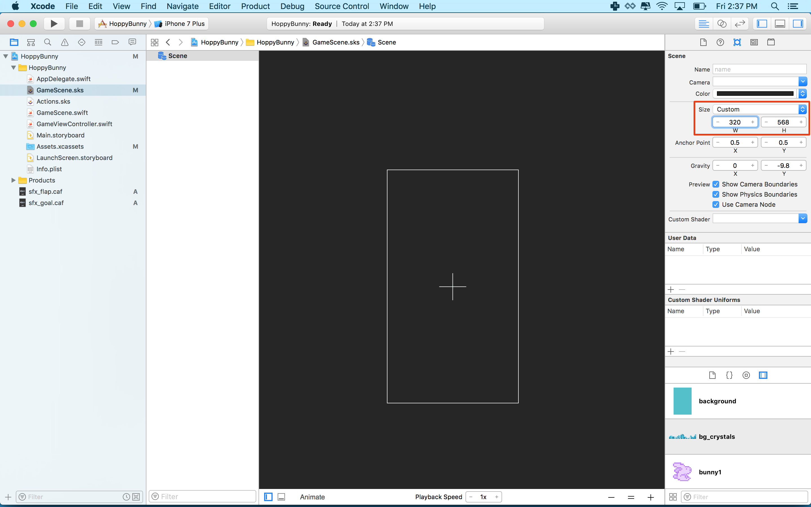

Let's get started setting up the main game scene, SpritKit Scene Editor is a powerful Xcode tool that lets you rapidly layout the scene.

#Setting the stage

> [action]
> Select *GameScene.sks* from the *Project navigator*:
>
> It's helpful to see the scene size, zoom out so you can see the yellow border which represents the scene size. Select `Editor / Zoom Out` or use the shortcut shown.
>
> Next modify the size parameters as shown in the *Attributes inspector panel*
> 

Remember the device resolution guide in the previous chapter? You will be using a common design size of 320 x 480, this gives you a nice portrait view, perfectly suited to the artwork.  You may be wondering what about supporting other devices?

Thankfully SpriteKit has your back and can automatically scale the view to fit other devices.

> [info]
> Have a look through the code in *GameViewController.swift*.  In particular:
>
```
/* Set the scale mode to scale to fit the window */
>
scene.scaleMode = .AspectFill
```
>
> If you `highlight` *scaleMode* and look at the *Quick Help inspector* panel you can find out more about the scaling options available.
>

##Add the background

> [action]
> Select *Show the media library* in the *Library pane*, add the background image by dragging *background.png* onto the stage:
>
> 
>
> You want to centre the background on the screen, you can do this by setting the *Position* to `(160, 240)` which is exactly half of the scene size values or drag it the image around by hand.
>
> When you add an object to the game scene this way a *Color Sprite* object is added to the scene and the texture property is pre populated with the texture name of the asset you dragged in.

<!--  -->

> [info]
> A really handy feature is to use object snapping, *Hold down shift* **(behavior as of Xcode 7.2.1)** while dragging your game objects and you will notice it will snap against existing scene objects.  Try moving it around and you will notice it will snap to the left hand edge of the scene, giving you that perfect center point position.
>

##Add the ground image

> [action]
> Scroll through the media library and drag *ground.png* into the scene.
> Set the position to `(160,32)` or anywhere you think looks good, it's your game after all.
>
> 
>

You'll notice the ground image extends beyond the screen border. Don't worry about it, you will be scrolling the ground later to create that endless runner effect.

##Add the clouds

> [action]
> Drag in *clouds.png* to the scene
> Set the *Position* to `(160, 385)` or any other value you think looks good.
>
> 
>

#Creating the Bunny Scene

Now you're going to create a new *SpriteKit Scene File* for the bunny and animate it.

> [action]
> Create a new *SpriteKit Scene File* by selecting `File > New > File > SpriteKit Scene`:
>
> 
>
> Because bunnies are heroes, save the file as `Hero.sks`
>
> 
>)

##Add the bunny

> [action]
>
> Select *Hero.sks* in the *Project navigator*
>
> Drag *bunny1.png* into scene:
>
> You may not be able to see the bunny, if not `Zoom Out` the scene, center your view on the bunny and `Zoom In` a little.
>
> You will be connecting the bunny in code later so you need a way to reference it.  This is typically done using the *Name* property, so set *Name* to `hero`.
>
> 
>

<!--  -->

> [info]
> Personally I dislike using the huge default scene size, when only dealing with a single asset. It can also cause unexpected position issues later on when using it as a referenced object.
> Click anywhere other than the bunny itself and set the scene *Size* (as you previously did with the *GameScene*) to `(16,16)`.  Why `(16,16)`, this is the *Size* of the *bunny* sprite.
> Set the *Anchor Point* to `(0.5,0.5)`

##Animating the bunny

Great, you have a static bunny.  However, we want this bunny to fly and the bunny can fly by flapping it's ears!
You are going to setup a sprite frame based animation ~`0.5` seconds long and repeat forever.

> [action]
> Open *Hero.sks*, select the *Object library* panel and look for the *AnimateWithTextures Action* and drag this
> into the start of the bunny *Timeline* as shown:
>
> 
>
> Set the *Duration* to `0.5`, feel free to have a play with this value.
>
> Time to add the animation frames, click on the *AnimateWithTextures Action* in the *Timeline* then click on the *Media library* panel.
> Drag *bunny1.png* and *bunny2.png* into the *Textures* box as shown:
>
> 
>
> Before we try the animation, let's make it loop.  Click on the *Circular arrow* in the bottom left of your *AnimateWithTextures Action* as shown and click the `Infinity` symbol.
>
> 
>
> 
>
> Finally time to see the bunny in action! Click *Animate* in the *Timeline* and watch that bunny go.
>
> 
>

#Summary

The game is already starting to take shape, you learnt to:

- Build the layout for your game scene using the SpriteKit Scene Editor.
- Create the hero of the game as a stand alone SpriteKit Scene
- Used the timeline and added your first action
- Added a sprite frame animation to bring the bunny to life

In the next chapter you will be adding physics to the game world.
