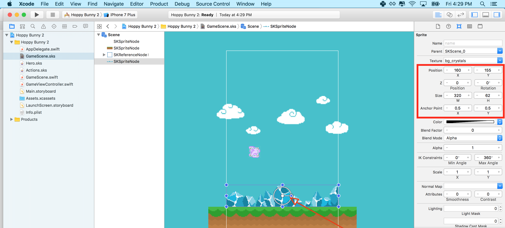
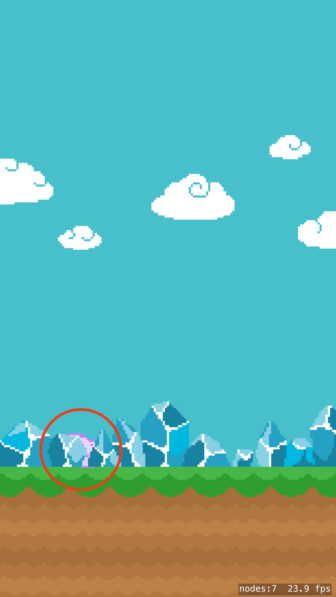
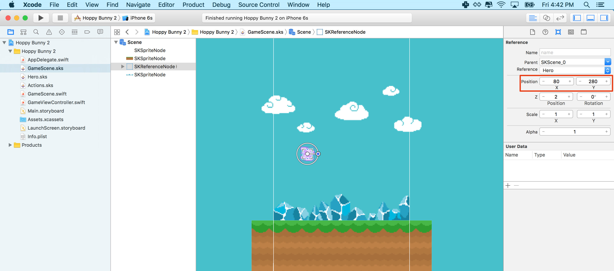

Time to setup physics for your game world and game play objects.

#SpriteKit Physics

You will be using the powerful physics engine built into SpriteKit, thankfully it's as easy as ticking a box to enable physics for each of our game objects.
I recommend you have a read of [Apple's Physics Documentation](https://developer.apple.com/library/ios/documentation/GraphicsAnimation/Conceptual/SpriteKit_PG/Physics/Physics.html#//apple_ref/doc/uid/TP40013043-CH6-SW1) as physics plays a key role in many games, a game may not even appear to be physics based yet will often use physics for collision detection as this on its own is a powerful feature.

##Make the ground static

> [action]
> Select the ground node, ensure the *Attributes inspector* is open and scroll down until you see the *Physics Definition* option.
> Set the *Body Type* to `Bounding rectangle`, which will present you will the additional physics properties.
> Set the body to be `static` by unchecking `dynamic`, there is no need for it to rotation so uncheck `Allows Rotation`, there is also need for it to be affected by gravity, so deselect `Affected By Gravity`.
>
> 
>

##Enable bunny physics

> [action]
> Open *Hero.sks* and select the Bunny sprite. Find the physics definition section and Set *Body Type* to `Bounding circle`.
> You should notice a faint circle around the bunny to show the physics body.
> Next check the following boxes *Dynamic*, *Allow Rotation* and *Affected By Gravity*. (By default they should be checked)
>
> 
>

<!--  -->

> [info]
> You might wonder why we only used a circle for our bunny physics definition.  When it comes to physics, less is always more, physics can be intensive on mobile devices and you want to simplify life as much as possible for the physics engine.
> Circles provide the best performance and if you can get away with just a circle then use it, the trick is using the most efficient shape for the job at hand.
>

##Adding the bunny to the world

> [action]
> To add the bunny to the game, drag the *Hero.sks* file into the scene. This will automatically create a *Reference node*  pointing to the *Hero.sks*
>
> 
>
> Set the position to `(80,280)`.
> The bunny looks a little small in the scene, set the *Scale* properties to `(2,2)` to double up the size of the bunny.
>

<!--  -->

> [info]
> Often *Reference node* are not displayed properly when initially placed into a scene, a quick *Save* of the scene should rectify this.

##Gravity

If you click outside of our *GameScene* yellow box and check the *Attributes inspector* you will see our physics world will default to approx Earth's gravity `-9.8`.


> [info]
> Also notice the *Debug Drawing* options in the inspector, the *Show Physics Boundaries* is handy to check that your > physics is where you think it should be. This creates the faint blue outlines.

##Adding the crystals

> [action]
> Let's add some pretty crystals above the ground to complete the visual appeal of *Hoppy Bunny Swift* by dragging `bg_crystals.png` into the scene:
>
> 
>
> Snap it top the top of *ground*.


#Check your progress

Let's check that gravity is running correctly, SpriteKit Scene editor allows you to check this without having to run the game. Select `Animate` in *GameScene.sks* as you did before in *Hero.sks*, you should see the animated hero succumb to the gravity and fall to the ground.  If it doesn't please go back and double check your work so far :]

> [action]
> Before you hit that `Run`, you need to clear out the default project template code.
> Open *GameScene.swift* and replace with the following:
>
```
import SpriteKit
>
class GameScene: SKScene {
    override func didMoveToView(view: SKView) {
        /* Setup your scene here */
    }
>
    override func touchesBegan(touches: Set<UITouch>, withEvent event: UIEvent?) {
       /* Called when a touch begins */
    }
>
    override func update(currentTime: CFTimeInterval) {
        /* Called before each frame is rendered */
    }
}
```
>

##Action
Now it's time to hit `Run` and see your game running in action.


> [info]
> I tend to run with iPhone 6 simulator as it's a little faster than the default 6s, a handy tip is also try `cmd+2` or `cmd+3` to reduce the scale to improve simulator performance.
> If you are setup to test on device then please do so, this will offer the best performance of all and would be
> what your player would see. Physics based games are best ran on device.

#Z Position

Argghh, it looks weird, the bunny is behind the crystals!



In SpriteKit there is no implied object rendering order, so all objects are rendered by default at a *Z-Position* of `0`.
So if your bunny is at the same position as the crystals, you will have unpredictable rendering results.

*Wait, so what is Z Position?*

Z-Position or Z-Order defines the render ordering for overlapping 2d objects.


Rectangle B is drawn after rectangle A. The result is rectB is drawn “above” rectA. RectB is said to have higher *Z-Position* than rectA.

You can easily set the *Z-Position* of your sprites in the *Attributes inspector*:



> [action]
> Keep it logical, imagine you are painting a scene, work from the back to the front. Set the **background** to `-1` then let's ensure the crystals and ground are on top of the background by setting them to `0` and then put our bunny on top of everything with a value of `2`.

Run the project again and it should look perfect now.


#Summary

It's coming along nicely now, so what did you learn?

- Added basic physics to the game
- Learnt how to use a reference node
- Used **Z-Position** to layer your sprites
- Finally got to run the game

Next chapter you will be adding player controls to the hero.
