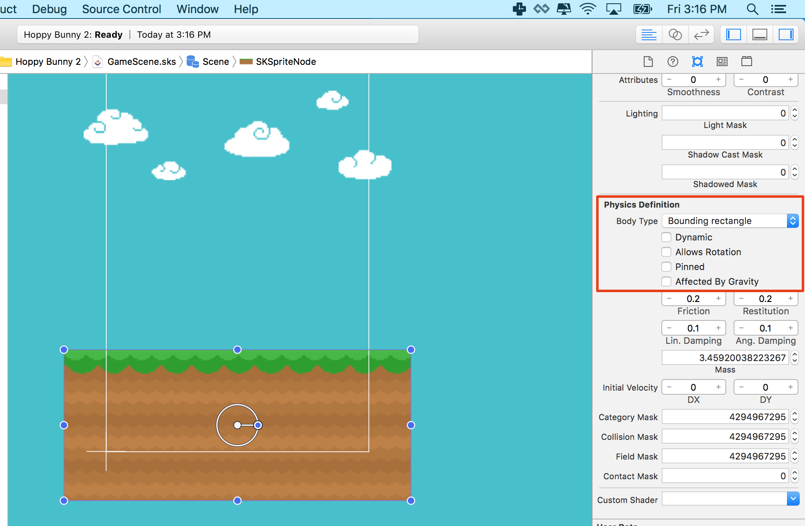
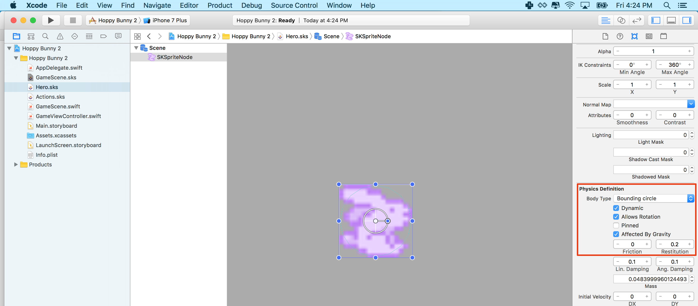

Time to setup physics for your game world and game play objects.

##SpriteKit Physics

We will be using the powerful physics engine built into SpriteKit, thankfully it's as easy as ticking a box to enable physics for each of our game objects. I recommend you have a read of [Apple's Physics Documentation](https://developer.apple.com/library/ios/documentation/GraphicsAnimation/Conceptual/SpriteKit_PG/Physics/Physics.html#//apple_ref/doc/uid/TP40013043-CH6-SW1) as physics plays a key role in many many games, a game may not even appear to be physics based yet will often use physics for collision detection as this on its own is a powerful feature.

#Make the ground static

> [action]
> Select the ground node, ensure the *Attributes inspector* is open and scroll down until you see the *Physics Definition* option.
> Change the *Body Type* to `Bounding rectangle`, which will present you will the additional physics dialog options.
> We want this body to be `static` so deselect `dynamic`, there is no need for it to rotate so deselect `Allows Rotation`, there is no need for it to be affected by gravity, so deselect `Affected By Gravity`.
>
> 
>

#Enable bunny physics

> [action]
> Open *Hero.sks* and select the Bunny sprite. Find the physics definition section and select `Bounding circle`.
> You should notice a faint circle around the bunny.
> Next check the following boxes are ticked *Dynamic*, *Allow Rotation* and *Affected By Gravity*. (By default they should be)
>
> 
>

<!--  -->

> [info]
> You might wonder why we only used a circle for our bunny physics definition.  When it comes to physics best practice, less is always more, physics can be CPU intensive and you want to simplify life as much as possible for the physics engine.
> Circles provide the best performance and if you can get away with just a circle then use it, the trick is using the most efficient shape for the job.

#Add the bunny to the world

> [action]
> To add the bunny to the game, drag the *Hero.sks* file into the scene. This will automatically create a *Reference node* referencing pointing to the *Hero.sks* contents.
>
> 
>
> Set the position to `(80,280)`, although as always free to play with this value.
> The bunny looks a little small in the scene, set the *Scale* properties to `(2,2)` to double the size of the bunny.
>

<!--  -->

> [info]
Often *Reference node* are not displayed properly when initially placed into a scene, this is generally fixed with a quick *Save* of the scene.

##Gravity

If you click outside of our *GameScene* yellow box and check the *Attributes inspector* you will see our physics world will default
to Earth's gravity.  


Also notice the *Debug Drawing* options in the inspector.

#Add the crystals

> [action]
> Before you run the game, let's add some pretty crystals above the ground to complete the visual appeal of *Hoppy Bunny Swift* by adding `bg_crystals` into the scene:
>
> 
>
> Hold down shift and drag it just above your ground, to snap it in place.

<!--  -->

> [info]
> If you notice a faint blue line between the crystals and the ground, this is created by the *Debug Drawing* option `Show Physics Boundries`.

#Check your progress

Before we build the project, select `Animate` in *GameScene* as you did before *Hero*, you should see the animated hero fall to the ground.  If it doesn't please go back and double check your work so far.

> [action]
> Confidence is high, before we hit that `Run` button we need to clear out the default project template code.
> Open *GameScene.swift* and ensure you code reads as follows:
>
```
import SpriteKit
>
class GameScene: SKScene {
    override func didMoveToView(view: SKView) {
        /* Setup your scene here */
    }
>
    override func touchesBegan(touches: Set<UITouch>, withEvent event: UIEvent?) {
       /* Called when a touch begins */
    }
>
    override func update(currentTime: CFTimeInterval) {
        /* Called before each frame is rendered */
    }
}
```
>

##Action
Now it's time to hit `Run` and see our game running in the simulator (or on a test device).


> [info]
> I tend to run with iPhone 6 simulator as it runs a bit faster than the default 6s, a handy tip is also try `cmd+2` or `cmd+3` to reduce
> the scale which improves simulator performance.
> If you can test with your device, this is best of all and performance should be a solid 60fps.

Argghh, it looks weird, the bunny is behind the crystals!


##Z Ordering

In SpriteKit there is no implied object rendering order, so all objects are rendered by default at Z Order 0.
So if our bunny is at the same position as the crystals, it's basically pot luck which object will end up on top.

*Wait, so what is Z Ordering?*

Z-order is an ordering of overlapping 2d objects.


Rectangle B is drawn after rectangle A. The result is rectB is drawn “above” rectA. RectB is said to have higher z-order than rectA.

We can easily change the Z Order of our sprites in the *Attributes inspector*:


> [action]
> Keep it logical, ensure the background is `0` then let's ensure the crystals and ground are on top of the background by setting them to `1` and then put our bunny on top of everything with a value of `2`.
>
> Run the project again and it should look perfect now.
>


#Summary

It's coming along nicely now, so what did we learn?

- Added basic physics to the game
- Learnt how to use a reference node
- Used Z Ordering to layer your sprites
- Finally got to run the project!

Next chapter we will be adding user controls to our hero.
