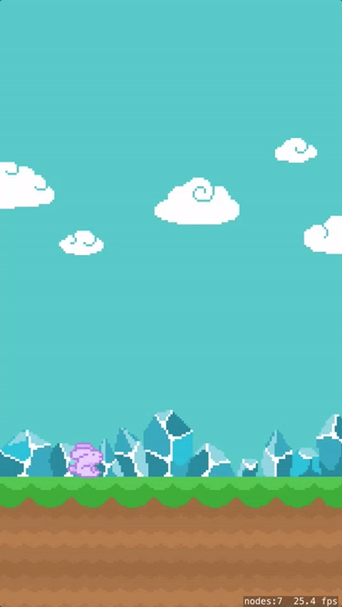

So far the bunny drops to the ground quickly and there is nothing the player can do about it, this would make for a pretty poor game experience.  In this section you are going to add player touch controls for the bunny and tweak the physics engine to ensure the physics are balanced with fun.

#Code Connections

Before you can control the bunny in Swift code, you first need to make a connection between the SpriteKit Scene object and the code.

If you recall you changed the name of the bunny sprite to `hero` in *Hero.sks*, this gives you a way to easily find this node in the *GameScene* scene graph.

You will now be doing work in *GameScene.swift* this file contains the code that runs the game. The file created with the project has some default code that we want to remove.

> [action]
> Open *GameScene.swift* by clicking it in the project navigator on the left. Delete the code in side the `GameScene` class.
>
> It should look like this when you are done:
>
```
import SpriteKit
import GameplayKit
>
class GameScene: SKScene {
    /* Game Code Here */
>
}
```
>

Next you will add a code connection to the `hero` in your `GameScene` Class.

> [action]
> Still in *GameScene.swift* setup the code connection.  
> Add the hero property to the top of the *GameScene* class.
>
```
class GameScene: SKScene {
>
  var hero: SKSpriteNode!
>
}
```
>

You now have a property to use for connecting to our bunny object.  However, this alone will not do anything, you then need to add some code to find the bunny inside *GameScene.sks* and assign it to our newly added `hero` property.

> [action]
> Add the following code to the `didMoveToView(...)` method:
>
```
override func didMove(to view: SKView) {
  /* Setup your scene here */
>
  /* Recursive node search for 'hero' (child of referenced node) */
  hero = self.childNode(withName: "//hero") as! SKSpriteNode
}
```
>

<!--  -->

> [info]
> You need to perform a recursive search as the hero node is not directly in the *GameScene*, even though you can see it in the scene editor. In the *GameScene* you added a `Reference node` which holds the bunny (it could easily be pointed to another *SpriteKit Scene* if we had one). You are making use of the `//` search operator to ensure the search will check all  nodes recursively in our scene.
>

#Adding touch

The goal is to have the bunny hop every time we touch the screen, which will keep the bunny flying high.

> [action]
> In *GameScene.swift*, add a touchesBegan event. This event notifies `GameScene` when a touch makes contact with the screen. Inside the `GameScene` class below (not inside!) `didMove(to view:)` start typing `touchesBegan` the name should appear on a popup menu, hit the *return/enter* key to auto-complete this function.
>
> Add the following inside `touchesBegan(touches:)`:
>
```
override func touchesBegan(_ touches: Set<UITouch>, with event: UIEvent?) {
  /* Called when a touch begins */
>        
  /* Apply vertical impulse */
  hero.physicsBody?.applyImpulse(CGVector(dx: 0, dy: 300))
}
```
>
> Here you are applying an impulse to the *hero's* `physicsBody`.  Think of an impulse like being hit by a baseball bat.
> In this case a short vertical burst to make the bunny move vertically.
>

<!--  -->

> [info]
> You'll notice the keyword `override` appears before `func` in the declaration of this method. An important concept in object-oriented programming is the idea of inheritance - that is, a child class inherits methods and properties from its parent class.
> We must use the `override` keyword to indicate that our child class will override its parent's implementation of `touchesBegan(...)`

<!--  -->

> [info]
> You'll also notice a lot of `?` and `!` when working with Swift on apps and games. For now, enter them as the tutorial tells you to. These characters are used when working with "optionals". Optionals are a bit more advanced Swift topic that you can explore after the winter academy ends. See the Dictionaries & Optionals assignment later in this course.
>
> You can think of `hero.physicsBody?.applyImpulse(CGVector(dx: 0, dy: 300))` as saying "if hero has a physicsBody, call the applyImpulse method, otherwise do nothing".

Now sit back and run your game and try out the new touch control.

#Adding a speed limit

It works, yet it doesn't feel right.  As you may have noticed while testing the touch implementation, when you touch the screen repeatedly, the impulses accumulate and the bunny blasts out of the screen. Gone for seconds or even (seemingly) forever.  To make the game playable, you will want to limit the vertical upward velocity. The best way to limit the bunny's speed is by modifying it in the *update* method, which is called every frame.

> [action]
> Add the update method. In the GameScene class start typing update, when the popup shows up find: `update(_ currentTime:)` on the menu and choose it by pressing the *return* key.
>
>  
>
```
override func update(_ currentTime: CFTimeInterval) {
  /* Called before each frame is rendered */
>
  /* Grab current velocity */
  let velocityY = hero.physicsBody?.velocity.dy ?? 0
>
  /* Check and cap vertical velocity */
  if velocityY > 400 {
    hero.physicsBody?.velocity.dy = 400
  }
}
```
>

You've added a simple yet effective modification.

- Grab the y velocity value of our bunny.
- Check this value and if necessary limit it to 400.

<!--  -->

> [info]
> You can think of `let velocityY = hero.physicsBody?.velocity.dy ?? 0` as saying "set velocityY to the hero's y velocity or to 0 if it has none".

There is no need to limit the falling speed or modify the x velocity as the bunny should never move horizontally.

Test your app now. The bunny should have a nice bump up each time you touch the screen. Good work!



#Make the bunny rotate

One of the nice visual touches in Flappy Bird is the way the bird rotates. When the player does not touch the screen for a little while, the bird turns towards the ground. Touching the screen makes the bird turn upwards again. You are going to imitate this behavior in Hoppy Bunny!

There are a couple of things you will need to do to achieve this:

- On touch, turn the bunny upwards.
- If no touch occurred for a while, turn the bunny downwards.
- Limit the rotation between slightly up and 90 degrees down.

> [action]
> The first step is to add a property to keep track of the time since the last touch. Add this declaration just after our hero property declaration.
>
```
var sinceTouch : CFTimeInterval = 0
```
>
> Next add this code to the `touchBegan(...)` method, after the application of vertical impulse `applyImpulse(...)`
>
```
/* Apply subtle rotation */
hero.physicsBody?.applyAngularImpulse(1)
>
/* Reset touch timer */
sinceTouch = 0
```

Applying continue angular impulse with no limitation will put the bunny into a wild head spin.  If you want to see this, go ahead and try the game now.

You need to limit the rotation of the bunny and also perform a downward rotation if no touch has occurred in a while. You perform both in the update method.

> [info]
> A great way to restrict values to a range is to use *clamp* functionality.  However, as it currently stands there is no
> handy clamp function available. Thankfully we've provided a handy file of helper functions you can add to the project.

<!--  -->

> [action]
> [Download CGFloat+Extensions.swift](https://github.com/MakeSchool-Tutorials/Hoppy-Bunny-SpriteKit-Swift3-V2/raw/master/CGFloat+Extensions.swift) and drag this file into your project.
> Ensure *Copy items if needed* is checked.
>
> 
>
> Feel free to explore this new code to see how it works.
>

Next you will apply the `clamp(...)` function to limit the rotation of the bunny, limit the angular velocity and increment the new `sinceTouch` timer.

> [action]
> Add this code at end of the `update(...)` method:
>
```
/* Apply falling rotation */
if sinceTouch > 0.1 {
    let impulse = -20000 * fixedDelta
    hero.physicsBody?.applyAngularImpulse(CGFloat(impulse))
}
>
/* Clamp rotation */
hero.zRotation.clamp(v1: CGFloat(-90).degreesToRadians(), CGFloat(30).degreesToRadians())
hero.physicsBody?.angularVelocity.clamp(v1: -2, 2)
>
/* Update last touch timer */
sinceTouch += fixedDelta
```
>

First thing you will notice are the red errors, you need to define the value for `fixedDelta`.

What is *delta*? Delta is the difference in time taken between rendering frames. The target FPS (Frames Per Second) is 60, which makes everything feel silky smooth, an optimal fixed delta time would be `1 second / 60 frames = 0.01666666666`.  For simplicity we will be using this value. However, in practice for more complex scenes we would calculate a more accurate delta.

> [action]
> Add the following code after the declaration of the `sinceTouch` property.
>
```
let fixedDelta: CFTimeInterval = 1.0 / 60.0 /* 60 FPS */
```
>

There are a couple things going on here:

- You check if more than a tenth of a second has passed since the last touch. If so apply an angular rotation impulse to tip the bunny over.
- You apply a clamp to the *Z-Rotation* to ensure the bunny says within the range we want.
- You apply a clamp to the *angularVelocity* to ensure the value does not get out of control.
- You add the *delta* (change in time) to the *sinceTouch* value to capture how much time has passed since the last touch event.

> [info]
> If you want to experiment with clamp values, a handy way is to use the Scene Editor to quickly visualize different values and then apply them in code. Click on *hero* and have a play with the *Z-Rotation* value, just remember to set it back to `0` when you're finished playing.
>

Now run your game again. The behavior should hopefully be similar to this:


#Summary

You've made some real progress in this chapter and learnt to:

- Code connecting **GameScene** objects to swift game code
- Add touch controls and apply physics forces
- Importing additional Swift functionality
- Clamping values to a range
- Learnt about *delta* and adding time counters

Hopping up and down is fun, but it would be even better if there was a sense of movement. In the next chapter you are going to get things moving.
