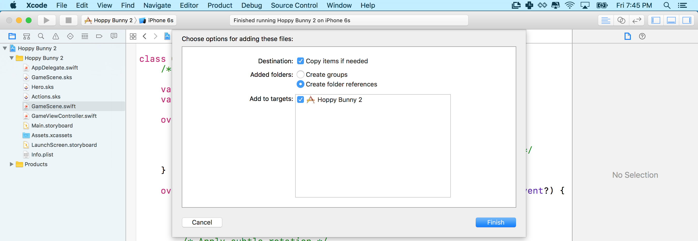

At the moment the bunny drops to the floor quickly and there is nothing a player can do to stop this! In this section you are going to tune some physics values and add touch controls so that the player can stop the bunny from falling.

#Making code connections

Before we can control the bunny via our Swift code, we first need to make a connection between our SpriteKit Scene and our code.

If you recall we changed the name of the bunny sprite to 'hero' in *Hero.sks*, this gives us a way to easily find our node in the GameScene tree.

> [action]
> Open *GameScene.swift*. In order to control our bunny, we need to setup our code connection.  Add our hero var to the top of our code as shown:
>
```
class GameScene: SKScene {

  var hero: SKSpriteNode!
```
>

We now have a var to store a reference to our bunny.  However, this alone will not do anything, we then need to add some code to find our bunny inside the scene tree and assign it to our newly added hero var.

> [action]
> Add the following hero node locating code into our `didMoveToView(...)` method as shown:
>
```
override func didMoveToView(view: SKView) {
       /* Setup your scene here */

       /* Recursive node search for 'hero' (child of referenced node) */
       hero = self.childNodeWithName("//hero") as! SKSpriteNode

```
>

<!--  -->

> [info]
> We need to do a recursive search as the hero node is not technically in our *GameScene*, even though you can see it in the editor. In our game scene we added a `Reference node` which holds our bunny (it could easily be pointed to another character if we had one). We make use of the `//` search operator to ensure the search will check all child nodes recursively in our scene.
>

#Adding touch input

Our goal is to have our bunny hop every time we touch the screen.

> [action]
> Take a look inside *GameScene.swift* we already have the `touchesBegan(...)` method ready and waiting for code.
> Modify this as shown:
>
```
override func touchesBegan(touches: Set<UITouch>, withEvent event: UIEvent?) {
        /* Called when a touch begins */

        /* Apply vertical impulse */
        hero.physicsBody?.applyImpulse(CGVectorMake(0, 300))
```
> We apply an impulse to our hero's `physicsBody`.  Think of an impulse like being hit by a baseball bat.
> In this case a short vertical burst to make our bunny jump higher.

<!--  -->

> [info]
> You'll notice the keyword `override` appears before `func` in the declaration of this method. An important concept in object-oriented programming is the idea of inheritance - that is, a child class inherits methods and properties from its parent class.
> We must use the `override` keyword to indicate that our child class will override its parent's implementation of `touchesBegan(...)`

Now sit back and run your game and try out the new touch control, good job!

#Adding a speed limit

As you may have noticed while testing the touch implementation, when you touch the screen repeatedly in short intervals, the impulses add up and the bunny shoots out of the top edge of the screen, gone for seconds or even (seemingly) forever. To make the game playable, you will want to limit the vertical upward velocity. The best way to limit the bunny's speed is via the *update* method, which is called every frame.

> [action]
> Modify the `update(...)` method as shown:
>
```
override func update(currentTime: CFTimeInterval) {
        /* Called before each frame is rendered */

        /* Grab current velocity */
        let velocityY = hero.physicsBody?.velocity.dy ?? 0

        /* Check and cap vertical velocity */
        if velocityY > 400 {
            hero.physicsBody?.velocity.dy = 400
        }
```
>

You've added a simple yet effective test, grab the y velocity value of our bunny, check this value and if necessary limit it to 400. There is no need to limit the falling speed or modify the x velocity as the bunny should never move horizontally.

#Make the bunny rotate

One of the nice details of Flappy Bird is the way the bird rotates. When the player does not touch the screen for a little while, the bird turns towards the ground. Touching the screen makes the bird turn upwards again. You are going to imitate this behavior in Hoppy Bunny!

There are a couple of things you will need to do to achieve this:

- On touch, turn the bunny upwards
- If no touch occurred for a while, turn the bunny downwards
- Limit the rotation between slightly up and 90 degrees down (just like Flappy Bird)

> [action]
> The first step is to add a property to keep track of the time since the last touch. Add this declaration just below our hero variable declaration.
>
```
var sinceTouch : CCTime = 0
```
>
> Next, extend the touch method to trigger the upward rotation on a touch. You implement this by applying an angular impulse to the physics body. Add this code inside the `touchBegan(...)` method, after the application of vertical impulse `applyImpulse(...)`
>
```
/* Apply subtle rotation */
hero.physicsBody?.applyAngularImpulse(1)

/* Reset touch timer */
sinceTouch = 0
```

Applying a high angular impulse will lead to the bunny turning upwards fast. If you like to see the bunny spinning wildly, go ahead and try the game now.

You still need to limit the rotation of the bunny and start a downward rotation if no touch occurred in a while. You will do both in the update method.

> [info]
> A great way to restrict a value to a range is to use clamp functionality.  However, as it currently stands there is no
> clamp function available. Thankfully we've provided a handy file of helper functions you can add to the project.

<!--  -->

> [action]
>  and  drag this file into your project.
>
> 
> Feel free to explore this file and see what functionality has been added.
>

Next we will apply the `clamp(...)` function to limit the rotation of the bunny, limit the angular velocity and increment the new `sinceTouch` timer.

> [action]
> Add these lines at the end of the `update(...)` method:
```
/* Apply falling rotation */
if sinceTouch > 0.1 {
    let impulse = -20000 * fixedDelta
    hero.physicsBody?.applyAngularImpulse(CGFloat(impulse))
}

/* Clamp rotation */
hero.zRotation.clamp(CGFloat(-90).degreesToRadians(),CGFloat(30).degreesToRadians())
hero.physicsBody?.angularVelocity.clamp(-2, 2)

/* Update last touch timer */
sinceTouch+=fixedDelta
```
>

First thing you will notice are the red errors, we need to define the value for `fixedDelta`.  What is *delta*? Delta is typically the time taken between rendering frames.  The target FPS (Frames Per Second) is 60, which makes everything feel silky smooth, an optimal delta time would be `1 second / 60 frames = 0.01666666666`.  For simplicity we will be using this value however in practice for more complex scenes we would calculate a more accurate delta.

> [action]
> Add the following code after the code declaring the `sinceTouch` var.
```
let fixedDelta: CFTimeInterval = 1.0/60.0 /* 60 FPS */
```
>

There are a couple things going on here. First, you add the *delta* (change in) time to the *sinceTouch* value to capture how much time has passed since the last touch. In the next line, we limit the rotation of the bunny.

Next, you check if the bunny allows rotation because later, you will disable rotation upon death. If rotation is allowed, you clamp the angular velocity to slow down the rotation if it exceeds the value range. Then you apply that new angular velocity.

Finally, you check if more than a tenth of a second passed since the last touch. If that is the case, a strong downward rotation impulse is applied.

> [info]
> If you want to experiment with clamp values, an handy way is to use the Scene Editor to quickly visualize different values and then
> use these in code. Click on *hero* and have a play with the Z Rotation value, just remember to change it back to 0 when you're finished.
>

Now run your game again. The behavior should be similar to this:


#Summary

Hopping up and down is fun, but it would be even better if our bunny was going somewhere!

You've made some real progress in this chapter:

- Connecting Game Scene objects to game code
- Added touch controls and applied physics forces
- Importing additional functionality and using clamp to limit hero values
- Learning about *delta* and adding a game logic timer

Next chapter time to get this world moving.
