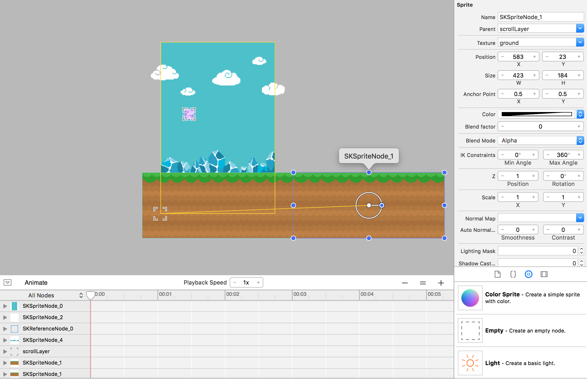

Time to bring this world to life, we will be creating a conveyor belt system to scroll our world objects toward the player, giving
illusion of the player moving.


#Ready to rock and scroll

> [action]
> We need to define a new member variable, which we will call `scrollSpeed`. Add the following line to *GameScene.swift* after the fixedDelta member variable:
>
```
let scrollSpeed: CGFloat = 100
```
>

Now you need to use that variable to manipulate the scroll speed of our conveyor belt, before we do this we need
to modify our *GameScene* to create a virtual layer for the objects we wish to scroll.  

> [action]
> Add an empty node to the scene, set the position to `(0,0)`, the Z Position to `2` and most important set the *name*
> to `scrollLayer`:
>
> 
>

Great, now we will to manipulate this object in our game code so lets create a code connection.

> [action]
> Switch to *GameScene.swift* and add a new member variable for `scrollLayer`, add this after your `hero` member variable definition.
>
```
var scrollNode: SKNode!
```
> Next add the code to connect the Scene Editor object with our new member variable.  It's similar to the `hero` connection, although there is no need to do a recursive node search as this node is a top level child of the game scene.
> Add the following after the hero node search connection.
>
```
/* Set reference to scroll layer node */
scrollLayer = self.childNodeWithName("scrollLayer")
```
>

Next time to ensure the `scrollLayer` is being moved every frame. Instead of shoving all of our code into the `update(...)` method
we will add a new method called `scrollWorld()` and reference this in our update step.

> [action]
> Add the following method at the end of the *GameScene* class (but before the last closing bracket):
>
```
func scrollWorld() {
  /* Scroll World */
  scrollLayer.position.x -= scrollSpeed * CGFloat(fixedDelta)
}
```
>
> Next add the following to the bottom of your `update(...)` method:
>
```
/* Process world scrolling */
scrollWorld()
```
>

<!-- -->

> [info]
> Defining a member variable for the scroll speed rather than simply defining the hero's position to be increased by *100* * *delta* every time is an important programming practice. Variable names offer us clarity - if someone else looks at your code, or even if you revisit it next week, it may not be clear what *100* affects. Explicitly using the variable `scrollSpeed` alleviates this problem. They also offer us flexibility. Imagine we were writing a larger program which used `scrollSpeed` in several places and instead of using a variable, we used *100* every time. What happens if we decide our scroll speed is a little slow? We will need to visit every place we wrote *100* and change it. It's not hard to understand how this could quickly get messy and inefficient.
>

Run the project... Oh no scrolling? Now that we have a virtual conveyor belt system, we need to add some objects to the belt.

> [action]
> This is really easy, simply select the *scrollLayer* node in the Scene Editor and modify the `parent` value to `scrollLayer`, this modifies the ownership of the ground node to be a child of the *scrollLayer* and thus any scrolling applied to the *scrollLayer* will affect its child nodes.
>
> 
>

Run the project. The ground should be scrolling, keep watching and we will run out of ground and the bunny will fall into the abyss.

#Loop the ground

You can make the ground loop by adding a second ground sprite and implementing an endless scrolling using both ground sprites. When a ground sprite leaves the left edge you'll move it to the right edge of the screen to make the ground seem endlessly repeating.

The first step will be adding a second ground sprite to the *GameScene.sks*

> [action]
> The easiest way to create another ground sprite is to duplicate the existing one via *Edit => Copy* and *Edit => Paste*. This has the advantage that you can make all settings below to one sprite, then copy it and only apply properties that are different. Alternatively you can just add a second ground image to the stage. If you create a new one then make sure to set the parent of the new ground node to *scrollLayer*
>
> I recommend holding down *shift* while dragging the ground sprite and snap it to the end of the original ground sprite.
>

Run the project, the ground will now scroll both grounds and so it will take a bit longer for the bunny to fall off the edge of the world.
The power of this setup is we can simply add new objects to the *scrollLayer* and they will move.  However, we want to ensure our ground sprites will loop around.

In the update method, you will perform a check for each ground sprite to see if it has moved off the screen, and if so, it will be moved to the far right and next to the ground sprite that's currently still visible on the screen.

> [action]
> Add the following chunk of code to the bottom of the `scrollWorld()`:
>
```
/* Loop through scroll layer nodes */
for ground in scrollLayer.children as! [SKSpriteNode] {
>
  /* Get ground node position, convert node position to scene space */
  let groundPosition = scrollLayer.convertPoint(ground.position, toNode: self)
>
  /* Check if ground sprite has left the scene */
  if groundPosition.x <= -ground.size.width / 2 {
>
      /* Reposition ground sprite to the second starting position */
      let newPosition = CGPointMake( (self.size.width / 2) + ground.size.width, groundPosition.y)
>
      /* Convert new node position back to scroll layer space */
      ground.position = self.convertPoint(newPosition, toNode: scrollLayer)
  }
}
```
>

This code retrieves the current screen position for each ground sprite. Since the ground sprites aren't children of the *GameScene*, you need to convert their relative position inside the *scrollLayer* to *GameScene* co-ordinate space using the `convertpoint(...)` method.

> [info]
> @todo This could do with a nice illustration

Once you have the position, you check if a ground sprite is off the screen. If that is the case, you move it to the right of the other ground sprite. You calculate the new position for the node in *GameScene* space and then have to convert this back to *scrollLayer* space.
This creates the ground's endless repeating effect.

If you run the game now, the ground will scroll endlessly as the bunny moves about.

#Summary

You learnt to create a scrolling world, don't worry if you don't get relative node conversion straight away, it can be confusing at first.
This sets the scene up nicely for adding our game obstacles which our bunny will need to jump through.  
