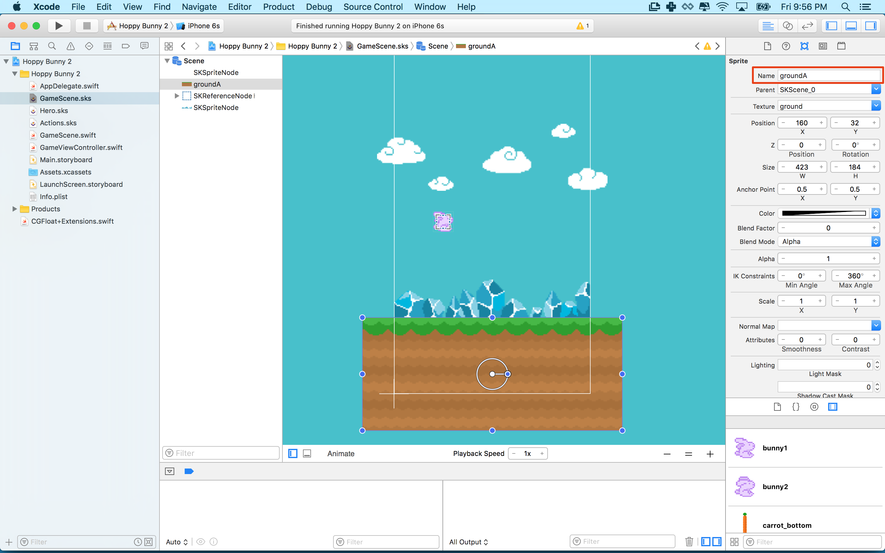
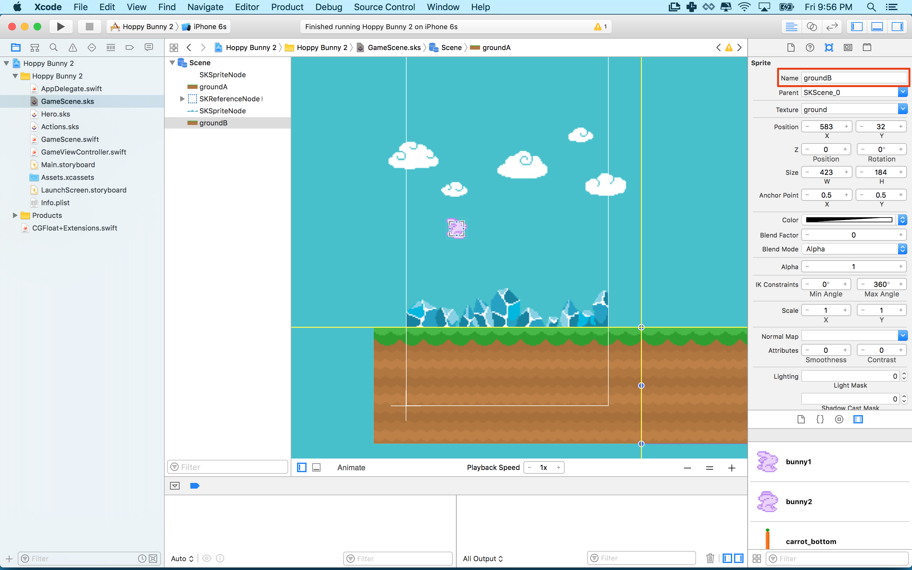
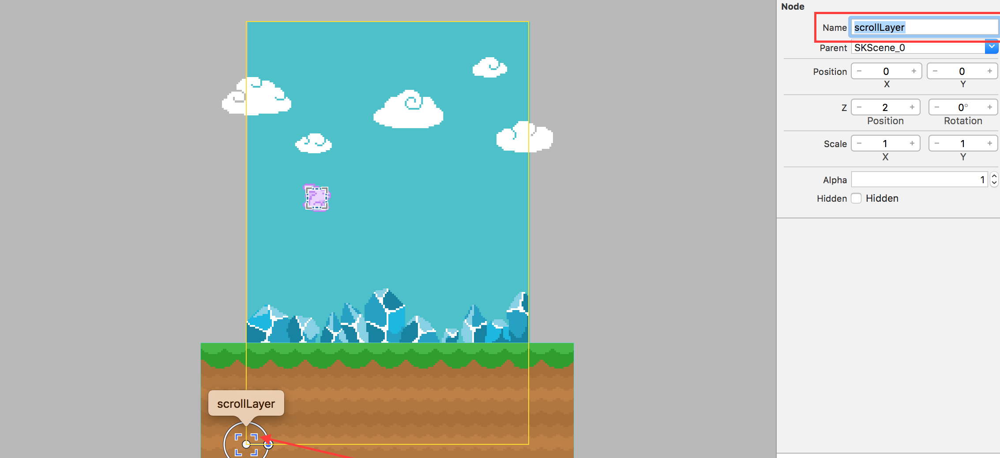
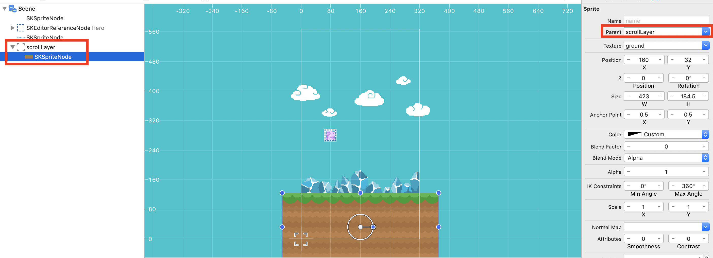
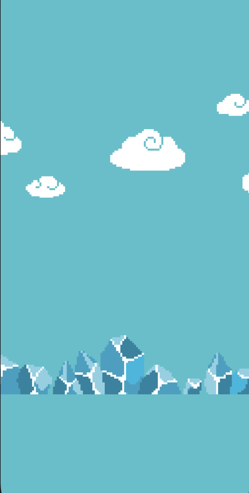
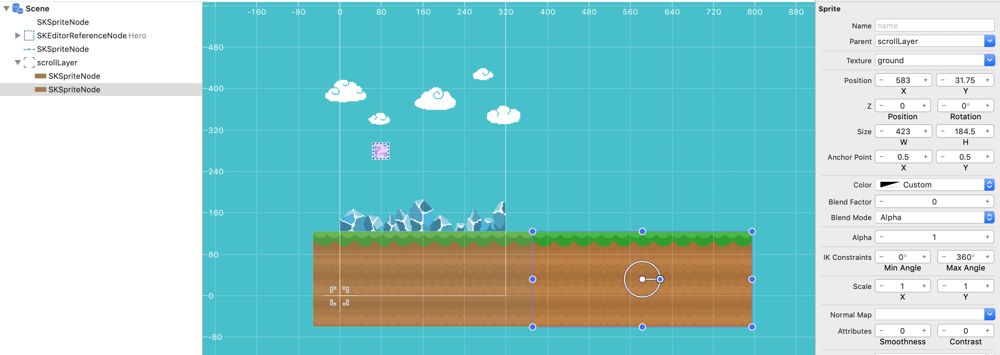

Time for you to bring this world to life, you will be creating a conveyor belt system to scroll the world objects toward the player, giving illusion of the player moving.


<!-- TODO: Consider rewriting the rest of the tutorial to use this method, currently inconsistent with the rest of the tutorial though :/ -->
<!-- # Scrolling Sprites

To scroll sprites we you will move a sprite to the left until gets off the screen, then move it twice it's width to the right where it will start crossing the screen again.

Since you will have several sprites to scroll you should write a function that will do the work for you.

> [action]
> Open *GameScene.swift* and add the following function to the `GameScene` class.
>
```
func scrollSprite(_ sprite: SKSpriteNode, speed: CGFloat) {
    sprite.position.x -= speed
>
    if sprite.position.x < sprite.size.width / -2 {
        sprite.position.x += sprite.size.width * 2
    }
}
```
>
> This needs a little explanation. The `scrollSprite()` method takes two parameters: sprite, the sprite to scroll,
> and speed, the distance in pixels to move the sprite to the left. Then the function checks the x position
> of the sprite. If the x position is less than negative half the width the function moves the sprite
> twice it's width to the right. The x coordinates counts positive going to the right, and negative going to the left. This means when a sprite's x position is negative half of it's width we know it's gotten all the way off the screen to the left.
>
> To create an endless scrolling ground plane you will use two sections.
>

# Creating endless ground

> [action]
> Open *GameScene.sks* select the ground and give it the name `groundA`.
>
> 
>
> You need a second ground sprite. You can easily copy the first ground sprite by holding option and dragging.
> Snap the new ground sprite to the right of the first. Then give the new ground sprite the name `groundB`.
>
> 
>

Now you need to make a connection in code to the two ground sprites: `groundA` and `groundB`.

> [action]
> Open *GameScene.swift* add the following at the top of the GameScene class under `let scrollSpeed`.
>
```
var groundA: SKSpriteNode!
var groundB: SKSpriteNode!
```
>
> Make a sprite reference new variables in `didMove(to View:)`.
>
```
/* Make a reference to ground sprites */
groundA = self.childNode(withName: "groundA") as! SKSpriteNode!
groundB = self.childNode(withName: "groundB") as! SKSpriteNode!
```
>

Now that you have your sprites set up call the `scrollSprite()` method in `update()`.

> [action]
> Add the following at the bottom of the `update()` method.
>
```
/* Scroll the ground sprites */
scrollSprite(groundA, speed: 5)
scrollSprite(groundB, speed: 5)
```
>

**Note!** It's important that the ground sprites both have the same speed! If the speeds are different one ground sprite will faster than then the other. With this in mind feel free to play with the speed value (5) to adjust the speed of the ground.

**Challenge**
Can you get the clouds to move past? What about the crystals? -->

# Ready to rock and scroll

To control the speed of this conveyor belt you will want to add a new *scrollSpeed* property to the *GameScene* class.

> [action]
> Add the following line to `GameScene.swift` after the `fixedDelta` property:
>
```
let scrollSpeed: CGFloat = 100
```

## Virtual scroll layer

You will need to use this property to manipulate the scroll speed of the conveyor belt, before you do this you need
to modify the *GameScene* to create a virtual layer for all the objects you wish to scroll.  

> [action]
> In `GameScene.sks`, drag an *Empty* node to the scene (Hit that `+` again and find it under the Objet library!), set the position to `(0,0)`, set *Z-Position* to `2` and set the *Name*
> to `scrollLayer`:
>
> 
>

<!--  -->

Next you need to create a code connection for the *scrollLayer*

<!--  -->

> [action]
> Open `GameScene.swift` and add the following after the `hero` property declaration.
>
```
var scrollLayer: SKNode!
```

Next you need to create the code connection to the Scene Editor object.  This step is very similar to creating the *hero* code connection, although this time there is no need to do a recursive node search as this node sits directly below the *GameScene*.

> [action]
> In `GameScene.swift`, add the following after the *hero* node code connection in the `didMove` function.
>
```
/* Set reference to scroll layer node */
scrollLayer = self.childNode(withName: "scrollLayer")
```

# Scroll World

To help organize your code, let's create a new method called **scrollWorld** and call this in the `update(...)` method.

> [action]
> In `GameScene.swift`, add the following method at the end of the *GameScene* class (but before the last closing bracket):
>
```
func scrollWorld() {
  /* Scroll World */
  scrollLayer.position.x -= scrollSpeed * CGFloat(fixedDelta)
}
```
>
> Then add the following to the bottom of your `update(...)` method:
>
```
/* Process world scrolling */
scrollWorld()
```

<!--  -->

> [info]
> Defining a member variable for the scroll speed rather than simply defining the hero's position to be increased by `100` * *delta* every time is an important programming practice.  Variable names offer us clarity - if someone else looks at your code, or even if you revisit it next week, it may not be clear what `100` affects.
> Explicitly using the variable `scrollSpeed` alleviates this problem. They also offer us flexibility. Imagine we were writing a larger program which used `scrollSpeed` in several places and instead of using a variable, we used `100` every time. What happens if we decide our scroll speed is a little slow? We will need to visit every place we wrote `100` and change it. It's not hard to understand how this could quickly get messy and inefficient.
>

Run the game.

# Adding objects to scroll

Oh, no scrolling?  Now that you have a virtual conveyor belt system, you need to put some objects on it :]

> [action]
> Open `GameScene.sks`, select the *ground* node in the scene editor and set the *Parent* value to `scrollLayer`, this modifies the hierarchy of the scene graph.
>
> The *ground* node is now a child of the *scrollLayer*, and thus any scrolling applied to the *scrollLayer* will affect any child nodes.
>
> 
>

Run the game.  The ground should be scrolling, keep watching...



**For some reason the crystals get messed up in the gif**

## Loop the ground

Argh eventually you will run out of ground and the bunny will fall into the endless despair of the abyss.

You can make the ground loop by adding a second ground sprite and implementing an endless scrolling technique using both ground sprites. When a ground sprite leaves the left edge you'll move it back to the right edge of the screen to make the ground seem endlessly repeating.

The first step will be adding a second ground sprite to `GameScene.sks`

> [action]
> Duplicate the existing *ground* by `Edit -> Copy` then `Edit -> Paste`. This way all the properties of ground are already setup.
> You should snap it to the end of the first ground piece. so that it looks like the following image:
> 

Run the game.

The ground will now scroll both grounds and so it will take a bit longer for the bunny to fall into the abyss.
The power of this setup is you can simply add new objects to the *scrollLayer* and they will scroll.  However, we want to ensure our ground sprites will loop forever, this is an infinite flapper after all.

In the update method, you will perform a check against every ground object in the *scrollLayer* to see if it has moved outside of the left edge of the screen, if so you will then relocate it to back to the right edge.

> [action]
> In `GameScene.swift`, add the following code to the end of the `scrollWorld()` method:
>
```
/* Loop through scroll layer nodes */
for ground in scrollLayer.children as! [SKSpriteNode] {
>
  /* Get ground node position, convert node position to scene space */
  let groundPosition = scrollLayer.convert(ground.position, to: self)
>
  /* Check if ground sprite has left the scene */
  if groundPosition.x <= -ground.size.width / 2 {
>
      /* Reposition ground sprite to the second starting position */
      let newPosition = CGPoint(x: (self.size.width / 2) + ground.size.width, y: groundPosition.y)
>
      /* Convert new node position back to scroll layer space */
      ground.position = self.convert(newPosition, to: scrollLayer)
  }
}
```
>

## Relative node position

This code retrieves the current screen position for each ground sprite. Since the ground sprites aren't children of the *GameScene*, you need to convert their relative position inside the *scrollLayer* to *GameScene* co-ordinate space using the `convertpoint(...)` method.

Once you have this world space position, you check if the ground sprite is outside of the the screen. If so then move it to the right edge of the screen. You calculate the new position for the node in *GameScene* (world space) and then convert this back to get the relative position in *scrollLayer* space.

This creates the ground's endless repeating effect.

Run the game. The ground should now scroll for eternity.  This is hard to test :]

# Summary

The game now has a sense of the bunny moving through space. You've learned:

- A helper function that takes parameters.
- Move objects using their position.x property.
- Create an endless scrolling mechanic.

In the next chapter it's time to add the challenge of obstacles.
