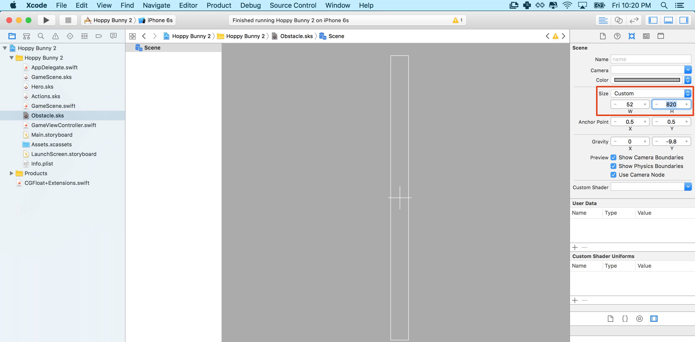
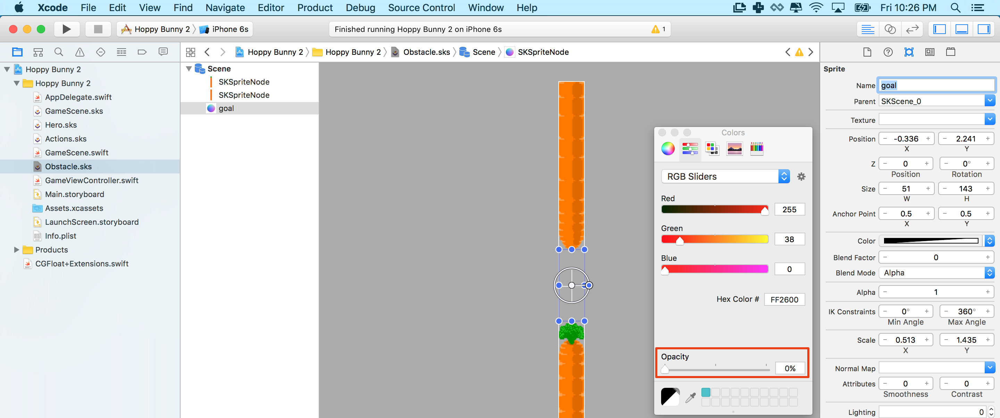

Now you will be adding obstacles and implement a mechanism to randomly create more obstacles as you hop along the level.

#Creating the obstacle

> [action]
> Create a new *SKS File* for our Obstacle:
>
> 
>
> 

You will construct the obstacles with two carrots, one at the top and one at the bottom and a transparent *Sprite* in between which will be used as a goal trigger - the player's score increases when colliding with the goal node.

> [action]
> Modify the size and anchor point of this new obstacle scene properties as shown:
> 
> Set Anchor Point to `(0.5,0.5)` and Size to `(51,768)`.
>
> Next add *carrot_top* and *carrot_bottom* from your *Media Library*, again remember to *hold shift* while dragging
> so you can easily snap the carrots in place.
> Next add a *Color Sprite* from the object library and position it between the carrot's as shown:
>
> 
>
> We want to change this sprite to be transparent as the player does not need to see it, it acts as an invisible sensor or trigger.
>
> Your final obstacle should look something like this:
>
> 

<!-- -->

> [info]
>So how did I know that the scene size should be exactly 51 pixels wide and 768 tall? Well I didn't at first, sometimes you
>need to have a play in the visual editor and then adjust, I saw the carrot's had a width of 51 so I used that value.
> The default height of 768 (iPhone 5) was no coincidence as the assets were designed to fill an iPhone 5 screen height  with a nice 100 pixel goal gap :)

> [action]
> You can test if you setup the obstacle correctly by dragging an instance of *Obstacle.sks* to the *GameScene.sks* by dragging the file onto the stage. Ensure you have saved your *Obstacle.sks* and if you don't see anything you may have to also save the *GameScene* to update the results. The result should be similar to this one:
>
> I'm sure you noticed the obstacle is sitting behind the crystals, we want it to sit in front of the crystals and also behind the ground.  
<!-- -->

Can you fix this? Remember we had a similar issue when we first setup the scene.

> [solution]
> When we first setup the scene we had a `Z Position` order issue.  The clouds have a Z Position of `1` and the ground has
> a `Z Position` of `2` yet we need to be in the middle?. So simply change these and set the Ground Layer to `3` and the `Obstacle`
> to `2`

Now this should look very similar to this:


#Generate obstacles in code

In this step you will dynamically add obstacles to the *GameScene* using your newly create *Obstacle.sks*.

> [action]
> Ensure you have *GameScene.swift* open.
> Before you add the obstacles let's add a new *Obstacle Layer* node to hold them, add the following property after
> *scrollLayer*:
>
```
var obstacleLayer: SKNode!
```
> Next you will add a timer property to help monitor the rate of obstacle generation, add the following after the *sinceTouch* property
> declaration:
>
```
var spawnTimer: CFTimeInterval = 0
```
> Great, as before with our scroll and hero nodes, we need to connect the *Obstacle Layer* we are about to create in *GameScene* to our code, add the following code connection after the *Scroll Layer* connection:
>
```
/* Set reference to obstacle layer node */
obstacleLayer = self.childNodeWithName("obstacleLayer")
```

Let's create the *Obstacle Layer* in *GameScene.sks* so we have an object for our code to connect to.

> [action]
> Ensure you have *GameScene.sks* open and drag an empty node into the scene.
> Set the position to `(0,0)`, Z Position to `2` and name to `obstacleLayer` so we can connect in code.
> 
>
> Next set the obstacle reference node's parent to the *ObstacleLayer*:
> 
>
> To ensure no Z ordering issues, change the Z Position of the *ScrollLayer* to `3`

<!-- -->

> [info]
> It can sometimes be tricky to select nodes in the editor when they are on top of each other, a handy tip is to use the scene
> hierarchy selector:
> 
>

Now that we have a code connection, you are going to create another conveyor belt type solution for the *ObstacleLayer*.

> [action]
> Ensure you have *GameScene.swift* open and add the following method to your *GameScene*:
>
```
func updateObstacles() {
   /* Update Obstacles */
>
   obstacleLayer.position.x -= scrollSpeed * CGFloat(fixedDelta)
>
   /* Loop through obstacle layer nodes */
   for obstacle in obstacleLayer.children as! [SKReferenceNode] {
>
       /* Get obstacle node position, convert node position to scene space */
       let obstaclePosition = obstacleLayer.convertPoint(obstacle.position, toNode: self)
>
       /* Check if obstacle has left the scene */
       if obstaclePosition.x <= 0 {
>
           /* Remove obstacle node from obstacle layer */
           obstacle.removeFromParent()
       }
>
   }
>
 }
 ```

This code should look familiar to the *ScrollLayer*, this time when an obstacle has left the scene it will be removed with the
`removeFromParent()` method.
Can you modify our game code to call the `updateObstacles()` method every frame?

> [solution]
> As with the `scrollWorld()` method, add the following to the `update(...)` method, after the `scrollWorld()` method.
>
```
/* Process obstacles */
updateObstacles()
```

Run the project and you should see the obstacle scroll past, sadly our bunny quickly runs out of carrots...
Our next task will be to continue spawning obstacles endlessly!

#Spawning endless randomized obstacles

You will now implement a mechanism that adds new obstacles on a timer basis, feel free to play around with
the timer and really challenge our bunny.

> [action]
> Add these lines to the end of your *updateObstacles* method:
>
```
/* Time to add a new obstacle? */
if spawnTimer >= 1.5 {
>
    /* Create a new obstacle reference object using our obstacle resource */
    let newObstacle = SKReferenceNode.init(fileNamed: "Obstacle")
    obstacleLayer.addChild(newObstacle)
>
    /* Generate new obstacle position, start just outside screen and with a random y value */
    let randomPosition = CGPointMake(352, CGFloat.random(min: 234, max: 382))
>
    /* Convert new node position back to obstacle layer space */
    newObstacle.position = self.convertPoint(randomPosition, toNode: obstacleLayer)
>
    // Reset spawn timer
    spawnTimer = 0
}
```

In the code above, every `1.5` seconds a new obstacle instance is created from out *Obstacle.sks*, it is then moved off just out of view and the Y Position is randomly set between the min value of `234` and max value of `382` to vary the challenge to the bunny.  
When deciding these sorts of gameplay values, it's handy to go back to the *GameScene.sks* and look at the Y Position of our obstacle.  
Then move it up and down and look at the Y Position, then pick a range that looks good to you.
Once you are finished set your obstacle just outside of the scene view, this will be your first obstacle!

> [info]
> You know that feeling when you play a great game and the core mechanic feels just right? This is rarely a happy coincidence, expect
> to play with game values, tweak settings and get feedback from others.

There is only one remaining thing to do, ensure the *spawnTimer* is keep tracking of time, much like the *sinceTouch* timer you created
previously. Can you add this yourself?

> [solution]
> Ensure the bottom of the `update(...)` method in *GameScene.swift* looks as follows:
>
```
/* Update last touch timer */
sinceTouch+=fixedDelta
spawnTimer+=fixedDelta
```

Now run your game. You should see an endless amount of scrolling obstacles! With random height!, you're getting closer to completing *Hoppy Bunny*!

#Summary

The gaming is really coming together now, you've learnt to:

- Create a reusable obstacle object
- Dynamically spawn obstacles using a timer
- Randomize obstacle object properties to challenge the player

Next chapter you are going to implement physics based collision detection.
