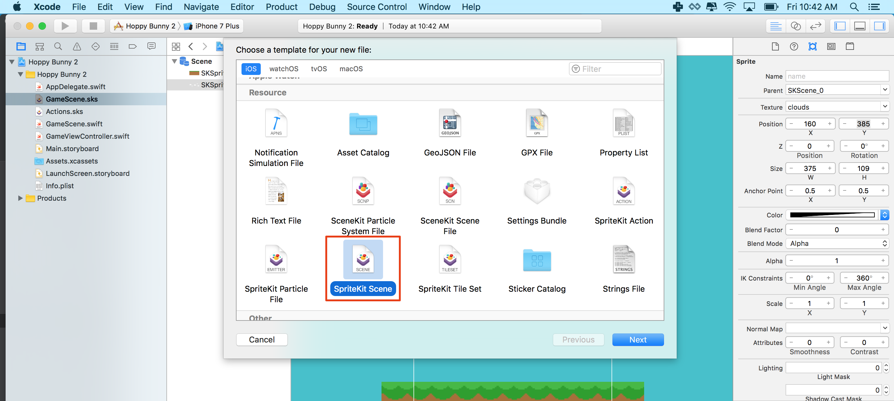
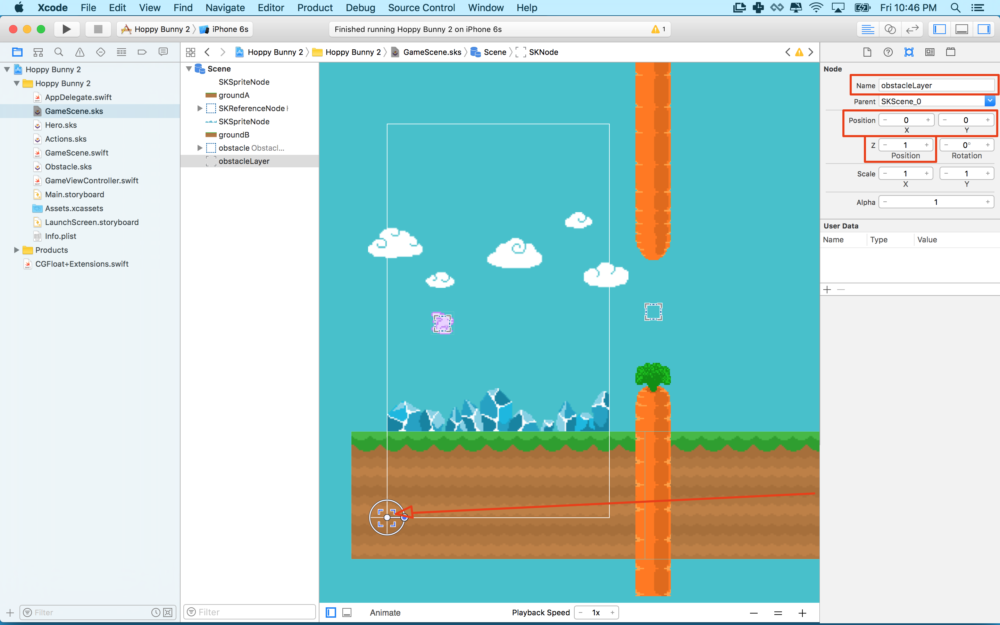

You are going to be creating obstacles for the player to navigate and implementing a mechanic to randomize their position to challenge the player.

#Creating the obstacle

> [action]
> Create a new *SpriteKit Scene File* by selecting `File > New > File > SpriteKit Scene`:
>
> 
> Save the file as *Obstacle.sks*
>
> 

You will be constructing the obstacle with two carrots, one at the top and one at the bottom and a special invisible *Color Sprite* between the carrots, which you will later use to score the player.

> [action]
> Modify the size and anchor point of this new obstacle scene properties as shown:
> 
> Set the *Anchor Point* to `(0.5, 0.5)` and *Size* to `(51, 820)`.
>
> Drag *carrot_top.png* and *carrot_bottom.png* from your *Media Library*, and snap the carrots in place.
> Next add a *Color Sprite* from the object library and position it in between the carrot's as shown:
> Set the *Name* to `goal`
>
> 
>
> You want to change the color values of the sprite to be transparent as the player does not need to see it, it acts as an invisible sensor or trigger. This will be discussed in more detail in the next chapter.
>
> Your final obstacle should look something like this:
>
> 
>

<!-- -->

> [info]
> So how did I know that the scene size should be exactly `51` pixels wide and `820` tall? Well, sometimes you
> need to have a play in the visual editor and then adjust, I saw the carrot's had a width of `51` so I used that value.
> The default height of `820` (iPhone 5) was no coincidence as the assets were designed to fill an iPhone 5 screen height, leaving a suitable `140` pixel gap for the player to pass through.
>

##Adding an obstacle

You can test if you've setup the obstacle correctly by adding it to the *GameScene*.

> [action]
> Open *GameScene.sks* and drag *Obstace.sks* into the scene, if you don't see anything, do a quick *Save* to refresh SpriteKit.
>
> I'm sure you noticed the obstacle is sitting behind the crystals, you will want it to sit in front of the crystals yet also sit behind the ground.  

Can you fix this? Remember you've ran into similar *Z-Position* issues when you initially setup the scene.

> [solution]
> Tweak the *scrollLayer* which contains the ground nodes, set *Z-Position* to `2` and set the z-Position of the *Obstacle* node to `1`.
>

<!--  -->

> [action]
> Open GameScene.sks. Select the obstacle node and give it the name:
> "obstacle"
>

Now this hopefully look a lot like this.


#Dynamic obstacle generation

Time to learn about dynamic obstacle generation or DOG for short :]
You added an a copy *obstacle.sks* to your scene. This is a sprite node. Your game will copy this node to create a relentless stream of obstacles for the player to avoid. To do this you will need a reference to the source obstacle.

In the image above you may have noticed that the obstacel was placed outside the visible area of the game scene. This obstacle will always sit outside of view and act as a source for obstacles that will move across the screen.

> [action]
> Add variable at the top of your class to hold a reference to the source obstacle:
> `var obstacleSource: SKNode!`
>

<!--  -->

> [action]
> Now set the value of the `obstacleSource` to the "obstacle" node in GameScene.sks using child(withName:). In didMove(to view:) add the following at the end of the method:
>
```
/* Set reference to obstacle Source node */
obstacleSource = self.childNode(withName: "obstacle")
```
>

##Obstacle layer

It will useful to create a layer to hold all of the obstacles. You can do this with a node in GameScene. By attaching all of the obstacles to a parent node they will draw at the z position of that node, and allow you to move all of the obstacles by moving the node.

> [action]
> Open *GameScene.sks* open and drag an *Empty* node into the scene.
> Set the position to `(0, 0)`, *Z-Position* to `1` and *Name* to `obstacleLayer`
>
> 
>

<!-- -->

> [info]
> It can sometimes be tricky to select nodes in the editor when they are on top of each other, an awesome tip that not everyone is aware of is to use the scene hierarchy selector:
>
> 
>
> You can thank me later :]

##Connecting the obstacle layer

You'll need to code connect the obstacle layer object.

> [action]
> Open *GameScene.swift*
> Add the following property to the *GameScene* class:
>
```
var obstacleLayer: SKNode!
```
>
> Add the following code after the *Scroll Layer* in the didMove(to view:) method. Create a connection:
>
```
/* Set reference to obstacle layer node */
obstacleLayer = self.childNode(withName: "obstacleLayer")
```

##Spawn Timer

You will add a timer property to help manage the rate of obstacle generation. Each time period we will generate a new obstacle. The time you choose is important to game play, too slow it's boring, too fast it's too hard.

> [action]
> Add the following code after the *sinceTouch* property declaration at the top of the GameScene class:
>
```
var spawnTimer: CFTimeInterval = 0
```
>

#Obstacle scrolling

You are going to create another conveyor belt solution for the newly added *ObstacleLayer*.

> [action]
> In *GameScene.swift* add the following method to the *GameScene* class:
>
```
func updateObstacles() {
   /* Update Obstacles */
>
   obstacleLayer.position.x -= scrollSpeed * CGFloat(fixedDelta)
>
   /* Loop through obstacle layer nodes */
   for obstacle in obstacleLayer.children as! [SKReferenceNode] {
>
       /* Get obstacle node position, convert node position to scene space */
       let obstaclePosition = obstacleLayer.convert(obstacle.position, to: self)
>
       /* Check if obstacle has left the scene */
       if obstaclePosition.x <= 0 {
>
           /* Remove obstacle node from obstacle layer */
           obstacle.removeFromParent()
       }
>
   }
>
 }
 ```

This code should look familiar it's similar to the code used in `scrollWorld()`. This time when an obstacle has left the scene, there is no longer any need for it, so it will be removed by calling the `removeFromParent()` method.

Can you modify your game code to call the `updateObstacles()` method every frame?

> [solution]
> As with the `scrollWorld()` method, add the following to the `update(...)` method, after the `scrollWorld()` method.
>
```
/* Process obstacles */
updateObstacles()
```

Running the game now will not do much. The `obstacleSource` node is not attached to the obstacleLayer. So it doesn't move. You are using this node as the source from which you will create an endless supply of copies.

#Spawning endless randomized obstacles

The next task will be to continuously spawn obstacles by copying the source obstacle you created in GameScene.sks.

To make the game interesting you will want each new obstacle appear at a different height.

> [action]
> Add this code to the end of your *updateObstacles* method:
>
```
/* Time to add a new obstacle? */
if spawnTimer >= 1.5 {
>
    /* Create a new obstacle by copying the source obstacle */
    let newObstacle = obstacleSource.copy() as! SKNode
    obstacleLayer.addChild(newObstacle)
>
    /* Generate new obstacle position, start just outside screen and with a random y value */
    let randomPosition = CGPoint(x: 352, y: CGFloat.random(min: 234, max: 382))
>
    /* Convert new node position back to obstacle layer space */
    newObstacle.position = self.convert(randomPosition, to: obstacleLayer)
>
    // Reset spawn timer
    spawnTimer = 0
}
```

The code above creates a new obstacle instance every `1.5` seconds from *Obstacle.sks*. So far `spawnTimer` has not been incremented you will do that in the next step.

We place this new obstacle off the right side of the screen and set the **Y Position** randomly between the **min** value of `234` and a **max** value of `382` to mix things up a little.

When deciding these sorts of gameplay values, it's handy to go back to *GameScene.sks* and check the **Y Position** of our obstacle.  Move it up and down and take note of the Y Position, then pick a range that looks good to you.

Once you are finished move the source obstacle outside of the scene on the right side. This way it will not be visible. Players will only see the copies as they are created.

> [info]
> You know that feeling when you play a great game and the core mechanic feels just right? This is rarely a coincidence, expect to adjust these values and tinker with mechanics, get friends to  play and ask for feedback. Keep adjusting the values until the game play feels right and your play testers are having fun!

Although you've added a *spawnTimer* property, it's not been setup to track time.
Can you think of how to do this?

> [solution]
> Add the following line to the end of you `update(...)` method:
>
```
spawnTimer+=fixedDelta
```

Now run your game...  You should obstacles being generated every `1.5` seconds and with varying vertical positions! You're getting closer to completing *Hoppy Bunny*!

#Summary

The gaming is really coming together now, you've learnt to:

- Building a multi object obstacle
- Dynamically generating obstacles in the scene
- Randomizing obstacle properties
- Removing objects from a scene when no longer required

In the next chapter you're going to implement physics based collision detection.
