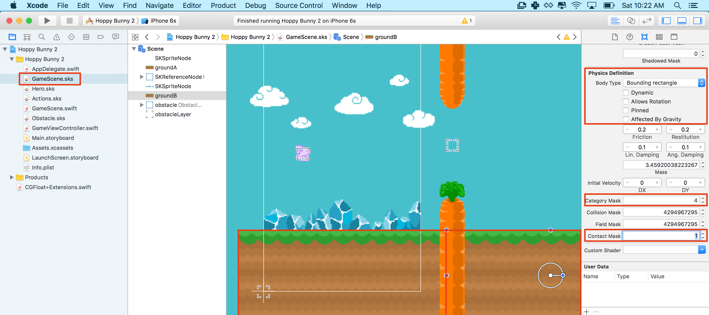
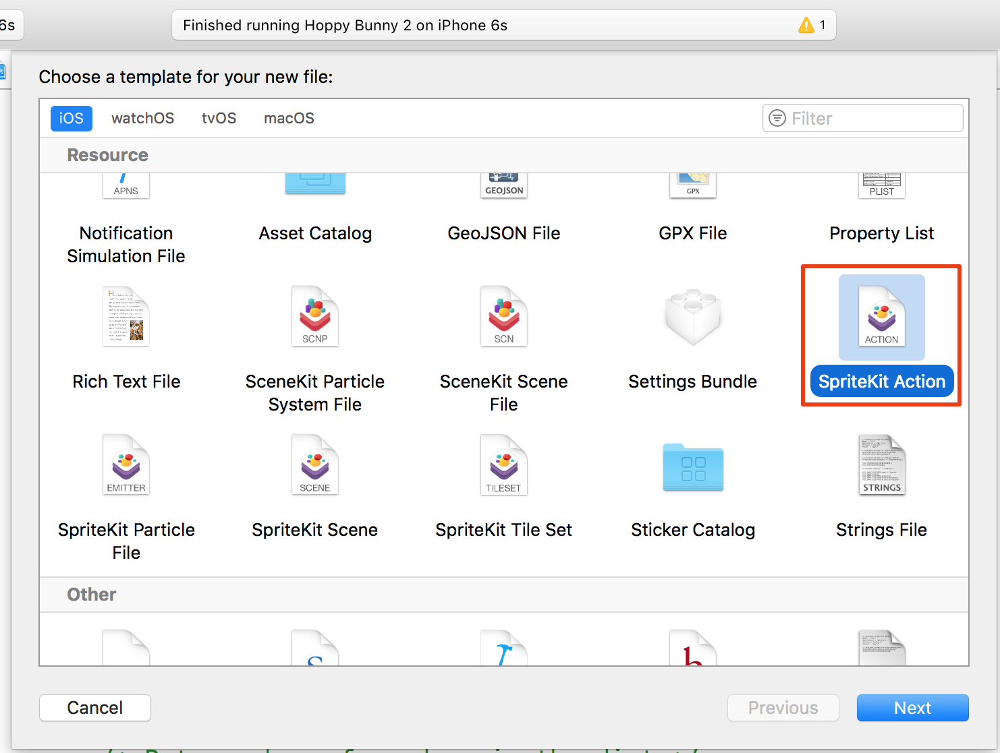

You are going to set up collision handling so that your game finally becomes a real game! At the moment the player passes through obstacles and lands on the ground. To make the game challenging the player will have to avoid the obstacles by manuvering through the space between the carrots and avoid hitting the ground! 

I would recommend you have a look at Apple's documentation on the subject of [Working with Collisions and Contacts.](https://developer.apple.com/library/ios/documentation/GraphicsAnimation/Conceptual/SpriteKit_PG/Physics/Physics.html#//apple_ref/doc/uid/TP40013043-CH6-SW14) It can be a little bit confusing when you first start, so don't worry if you don't understand everything at once.

In this tutorial you will setup physics collisions and contacts in the scene editor, in later tutorials you will expand this knowledge implementing physics setup in code.

#Quick overview of physics

Physics objects have few properties that determine how they interact with each other. These are 

- Category Bit Mask
- Contact Bit Mask
- Collision Bit Mask

#Category bit mask

This value identifies which category a physics object belongs to. You use this to declare how objects interact. You can say objects of category 1 will collide with objects of category 2 for example. 

#Contact Bit Mask

The contact bit mask determines which category of objects an object produces contact events for. It's important to understand that contact events do not produce a physical collision! In other words, an object my produce a contact event while passign through another physics object. 

In your game you want the bunny to pass the "goal" object that sits between the two carrots. You also want to know when the bunny makes contact with the "goal" to score a point for the player. 

#Collision Bit Mask

The collission bit mask determines which category of objects a physics object collides with. A collision is a physical interaction. When an object collides with another object it there is a physical effect! For example one object may bounce off the other or knock the other object over. 

#Physics Categories values

Physics category are read as binary values with a value of 2 to the power of 32. So 0 would look like: 

`00000000000000000000000000000000`

The value 1 would translate to: 

`00000000000000000000000000000001`

A value of 2 would be: 

`00000000000000000000000000000010`

Binary values only contain 1s and 0s!

When the *category* value of an object has a 1 in the same position as the value for *collision* then the objects collide. The same is true for contacts. For example, objects of category:

`00000000000000000000000000000010`

Will collide with objects whose have a collision bitmask of: 

`00000000000000000000000000000011`

This object would also collide with objects whose category is:

`00000000000000000000000000000001`

Let's apply this idea to the game. So far you have the following types of objects:

- Player
- Obstacle
- Ground
- Goal Sensor

Let's give them each a unique binary value. They each need a value with a 1 in a different column from the others. 

- `00000001` = 1 = Player
- `00000010` = 2 = Obstacle 
- `00000100` = 4 = Ground
- `00001000` = 8 = Goal Sensor

These are each unique categories becuase they each have a 1 in a unique column. 

#Collision Bit Masks

When you set the collision bit mask you are deciding which objects will produce a physical collision. In your game you want the bunny/hero (1) to collide with the carrots/obstacle (2) and the ground (4). 

- `00000001` = 1 = Player
- `00000010` = 2 = Obstacle 
- `00000100` = 4 = Ground
- `00000111` = 7 = **Collision for player**

Notice that 1+2+4 = 7. Also notice that in binary the number 7 shares a 1 in the same columns as Player, Obstacle, and Ground. 

#Contact Bit Masks

A contact doesn't produce a physical interaction but it is noticed by the physics engine. You want to know when the player (1) makes contact with the goal (8) becuase they will score a point. You also wnat to know when the player contacts the 

- `0010` = 2 Obstacles  
- `0100` = 4 Ground     
- `1000` = 8 Goal       
- `1111` = 15 **Contacts Contact for player**  

You could also use `4294967295` for the Player since you want to know when the the player contacts anything. 

`11111111111111111111111111111111` = 2^32 = 4294967295

#Setup physics

Currently the obstacles don't use physics. You will apply physics in the next step:

> [action]
> Open *Obstacle.sks*, make the following changes to both **carrots** and the invisible **goal** section.
> Enable physics by setting the *Body Type* to `Bounding rectangle`. Uncheck the 4 boxes that appear below.
>
> 
>
> Set the *Category Mask* to `2` and the *Contact Mask* to `1`
>
> Be sure to apply these steps to both carrots. 
>

> [action]
> Select the goal object. Choose `Bounding Rectangle` as the *Body Type*. Uncheck the 4 boxes that appear below. 
>
> Set the *Category Mask* to `8` and the *Contact Mask* to `1`. 
>

#Bunny physics

> [action]
> Open *Hero.sks* and `click` on the bunny. The Body Type should `Bounding Circle`. Below this
> set *Category Mask* to `1`, *Collision Mask* to `7` and the *Contact Mask* to `15` (or `4294967295` this is 2^32 if you prefer).
>
> 
>

#Ground physics

You need to setup the ground sprite physics, do you think you can tackle this yourself?
Check back if you don't remember the *Category Mask* value we decided to use.  What value do you think you'll need for the *Contact Mask?*

> [solution]
> Open  *GameScene.sks* and modify both **ground** sprites. The *Body Type* should be `Bounding Rectangle`, and the four boxes below should unchecked.  
> Set *Category Mask* to `4` and *Contact Mask* to `1`, you want to be informed if the bunny has hit the ground.
>
> 
>

Run your game... The bunny will now collide with the obstacles yet thankfully be able to flap through the goal gap.  Well if you're good enough :]

Currently the bunny will get pushed off the screen if you collide with a carrot. Don't worry about this it's a physics interaction that you set up. You will be taking care of this in a later step. For now just restart the simulator and try again. 

#Physics Contact Delegate

If the bunny collides with the ground, an obstacle or passes through the goal of an obstacle, you want to know about. Next you will implement the *Physics Contact Delegate* so your code will be informed whenever one of these collision contacts takes place.

Remember earlier when you set the *Contact Bit Mask*? Here you informed the physics system which contacts you were interested in, and through the contact delegate you will be informed when they occur. 

> [action]
> Open *GameScene.swift*. You need to declare the *GameScene* class will implement the *SKPhysicsContactDelegate* protocol methods.
> To learn more about *Protocols* and *Delegates* please check out our [Swift Concepts Guide](https://www.makeschool.com/tutorials/swift-concepts-explained).
>
> You declare that a class is implementing this protocol in Swift by appending *SKPhysicsContactDelegate* after the class' super class *SKScene*, separated by a comma, as shown:
>
```
class GameScene: SKScene, SKPhysicsContactDelegate {
```
>

##Delegate Support

The *GameScene* class is now ready to implement the contact delegate, first you should inform the delegate which class will take responsibility for handling the messages.   You should assign *GameScene* as the collision delegate.

> [action]
> Add the following code to the `didMove(to view:)` method:
>
```
/* Set physics contact delegate */
physicsWorld.contactDelegate = self
```

Finally, you can implement the *didBeginContact* method that will be called whenever a collision takes place that you want to know about e.g. The ones with a *contactMask* of `1`.

> [action]
> Add this new method to the *GameScene* class:
>
```
func didBegin(_ contact: SKPhysicsContact) {
  /* Hero touches anything, game over */
  print("TODO: Add contact code")
}
```
>

Run the game... Any time you collide with the ground, a carrot or a goal sensor the *TODO* message will be logged to the console.

#Game over

Instead of simply showing a message in the console, it would be nice to think about the game over scenario.

This might consist of:

- The bunny falling to ground
- The game Scene shakes
- A restart game button

##Adding a button

There is no easy way to add a button in SpriteKit so you will need to get creative and create our own solution.  To help we've provided a starting point for you with a custom class called *MSButtonNode*.

> [action]
> [Download MSButtonNode.swift](https://github.com/MakeSchool-Tutorials/Hoppy-Bunny-SpriteKit-Swift/raw/master/MSButtonNode.swift) and drag this file into your project.

<!-- -->

> [action]
> Add the *restart_button.png* to your scene by opening the media *Media Library* in the lower right and dragging it into *GameScene.sks*
> Set the *Name* to `buttonRestart`, set the *Z Position* to `10`, you want to ensure this UI (User Interface) element sits on top of everything visually.
>
> 
>
> To turn this sprite into a custom button, you need to change the class to be an instance of `MSButtonNode` instead of `SKSpriteNode`, you can use the *Custom class* panel to change this by setting the *Custom Class* to `MSButtonNode`
>
> 
>

Can you setup a code connection for this button?

> [solution]
> Open *GameScene.swift*, add a property for the button to the *GameScene* class:
>
```
/* UI Connections */
var buttonRestart: MSButtonNode!
```
>
> When you connect this node you need to ensure the node is downcast to the `MSButtonNode` class.
> Add the following to the `didMoveToView(..)` method.
>
```
/* Set UI connections */
buttonRestart = self.childNodeWithName("buttonRestart") as! MSButtonNode
```
>

##Selection handler

The code connection is ready, if you run the game you can touch the button, it looks like it was touched yet nothing happens.  You need to add some code to be executed upon user touch.

> [action]
> Add the following code after the code connection:
>
```
/* Setup restart button selection handler */
buttonRestart.selectedHandler = {
>
  /* Grab reference to our SpriteKit view */
  let skView = self.view as SKView!
>
  /* Load Game scene */
  let scene = GameScene(fileNamed:"GameScene") as GameScene!
>
  /* Ensure correct aspect mode */
  scene.scaleMode = .AspectFill
>
  /* Restart game scene */
  skView.presentScene(scene)
>
}
```
>

This code loads in a fresh copy of the *GameScene.sks*, ensures the correct *scaleMode* is applied and then replaces the current scene with this fresh *GameScene*. You can find this code in `GameViewController.swift` and how the *GameScene* is initially loaded when the game starts.

##Hide the button

Great you have a button, as it's bang in the middle of the screen it might be an idea to hide it once the game is in-play.

> [action]
> Add the following code after the selection handler setup.
>
```
/* Hide restart button */
buttonRestart.state = .MSButtonNodeStateHidden
```
>

You want the button to be visible when the bunny dies, let's look at how we implement our game over scenario.
It would be really useful to know the current state of the game.  Has the game started, is the player dead e.t.c ?

#Game State

State management is a great way to do this, just look intp the `MSButtonNode` code above.  A `state` property is used to track if the button is `Active,Hidden or Selected`.

For the *GameScene* class it would be great to know if the game state is either `Active` or `GameOver`.  

When this `GameOver` state applies you want to:

- Kill the bunny
- Stop the world scrolling
- Show the restart button
- Ignore any touch other than the button

An *Enumeration* is a great way to setup a custom state type.

> [action]
> Add the following `Enumeration` to the top of *GameScene.swift*:
>
```
enum GameSceneState {
    case Active, GameOver
}
```
>
> To track the state you need to add a `gameState` property to the *GameScene* class.
> Set the default to `Active`
>
```
/* Game management */
var gameState: GameSceneState = .Active
```
>

#Bunny death

Great you now have some rudimentary game management in place, time to kill the bunny!

> [action]
> Replace the `didBeginContact(...)` method as shown:
>
```
func didBeginContact(contact: SKPhysicsContact) {
  /* Hero touches anything, game over */
>
  /* Ensure only called while game running */
  if gameState != .Active { return }
>
  /* Change game state to game over */
  gameState = .GameOver
>
  /* Stop any new angular velocity being applied */
  hero.physicsBody?.allowsRotation = false
>
  /* Reset angular velocity */
  hero.physicsBody?.angularVelocity = 0
>
  /* Stop hero flapping animation */
  hero.removeAllActions()
>
  /* Show restart button */
  buttonRestart.state = .MSButtonNodeStateActive
}
```

Notice the check of the **gameState** to ensure that the code will not be called more than once, when the player has died.  The bunnies physics are effectively disabled by stopping `rotation`, reseting `angularVelocity` and removing the flapping asprite frame animation with the use of `removeAllActions()` method.  The button is then activated and presented to the player  with a simple `MSButtonNodeStateActive` state change.

Run the game... When the player dies the button should appear and you can restart play.  

#Shutting down the world

It's not perfect yet as the bunny will still respond every so slightly to touch and the world will continue to scroll by.

To disable scrolling and touch, you can once again make use of the *gameState* property.

> [action]
> Add the following to the very top of the `update(...)` method:
>
```
/* Skip game update if game no longer active */
if gameState != .Active { return }
```
>

Can you figure out how to disable touch?

> [solution]
> Add the following to the top of the `touchesBegan(...)` method:
>
```
/* Disable touch if game state is not active */
if gameState != .Active { return }
```

Run the game... Death truly should be final for our bunny.

#Death actions

It would look better if the bunny fell face first upon hitting an obstacle.  A powerful way to do achieve this is using *SKActions*, you've already used actions to setup the the flappy animation frames.

> [action]
> Add the following code after you stopped the hero's actions with the `removeAllActions()` method in `didBeginContact(...)`:
>
```
/* Create our hero death action */
let heroDeath = SKAction.runBlock({
>
    /* Put our hero face down in the dirt */
    self.hero.zRotation = CGFloat(-90).degreesToRadians()
})
>
/* Run action */
hero.runAction(heroDeath)
```
>

The `runBlock` action lets you define your own custom action and in this case, manually rotate the bunny face down. You need to wrap this in an action to ensure it is executed at the correct **step** in the **rendering loop**.  You could also achieve this with *overriding* the `didSimulatePhysics` step and applying this rotation.  However, it's kind of awkward to do and cleaner to wrap in an *SKAction*.

Run the game... The bunny should be face down now upon any collision. It's all about those little bits of polish :]

#Shake it

It would be nice to add an old school style Star Trek camera shake to emphasize the impact.  This time you will create your own *GameEffects.sks* **SpriteKit Action file**, this enables you to store multiple effects that can be reused on any node.


> [action]
> Create a new *SpriteKit Action* file called `GameEffects`:
>
> 
>
> 
>
> Add your first *Action*, name it `Shake`
> 
>
> Now you have an empty action timeline ready for some actions, drag across the *Move action* from the *Object Library*.  Set the *Duration* to `0.2` seconds.
>
> 
>
> **Sadly it does not yet seem possible (As of Xcode 7.2.1) to preview this action on the scene from within the scene editor :[**
>
> Copy and paste this action two times and then modify all three actions as follows.
>
> Set *Timing Function* to `Ease In`, set *Offset* to `(8,2)`
> Set *Timing Function* to  `Ease Out`, set *Offset* to `(-4,-2)`
> Set *Timing Function* to `Ease Out`, set *Offset* to `(4,2)`
>

##Shake all the nodes

Time to try this out in our code, you don't need to worry about loading the file itself, SpriteKit will automatically load any SpriteKit related resources and cache them at runtime :]

> [action]
> Open *GameScene.swift* and add the following code after the death action.
>
```
/* Load the shake action resource */
let shakeScene:SKAction = SKAction.init(named: "Shake")!
>  
/* Loop through all nodes  */
for node in self.children {
>      
    /* Apply effect each ground node */
    node.runAction(shakeScene)
}
```
> The effect can not be applied directly to the *GameScene*, so you need to loop through all the child nodes in the
scene and apply them individually.  Thankfully it is straight forward to do so.

Run the game...  When the bunny dies the screen should give a short shake.

> [info]
> I encourage you to make this effect as crazy as you like, experimentation is the best way to learn what works.  Often it's the happy little accidents lead you onto something awesome.

#Physics tweaking

You may have noticed the game is a little difficult, perhaps too difficult.  It feels like the bunny falls too hard initially and applying the touch impulse doesn't feel quite right.

> [action]
> Open *Hero.sks*, click on the bunny and navigate down to the physics properties, notice the *Initial Velocity* property.  Set this to `(0,400)`.  This should give the player a much need reaction time cushion when the game first runs.

> 
>

When the bunny is falling and the player touches the screen, the touch feels a little sluggish.  This is due to the cumulative downward velocity generated by the bunny's fall.  If you reset the vertical velocity at the point of touch this might make it feel more responsive.

> [action]
> Open *GameScene.swift*, add the following in the `touchesBegan(...)` method after the `gameState` check:
>
```
/* Reset velocity, helps improve response against cumulative falling velocity */
hero.physicsBody?.velocity = CGVectorMake(0, 0)
```
>

Run the game... That little change has made the core mechanic feel much more satisfying :]

> [info]
> Bonus tip for making it so far:  You've added a lot of code and your formatting may be getting a little, well ugly.  
> Thankfully there is an easy way to tidy up your code with *Re-Indent*
> Open *GameScene.swift* then select all your code with *Cmd+a*, then press *Ctrl+i* to Re-Indent.
>

#Summary

Wow, a lot of ground has been covered in this chapter:

- Understanding the principles of SpriteKit physics collision and contact masking
- Implementing the `SKPhysicsContactDelegate` so you are informed of collision conacts.
- Creating your own custom button class
- Implementing a simple game state manager
- Running a custom *SKAction* and creating reusable *SKActions* visually
- Tweaking core mechanics, making the gameplay feel just right.

Next up, it wouldn't be a game without a scoring mechanism for the player.
