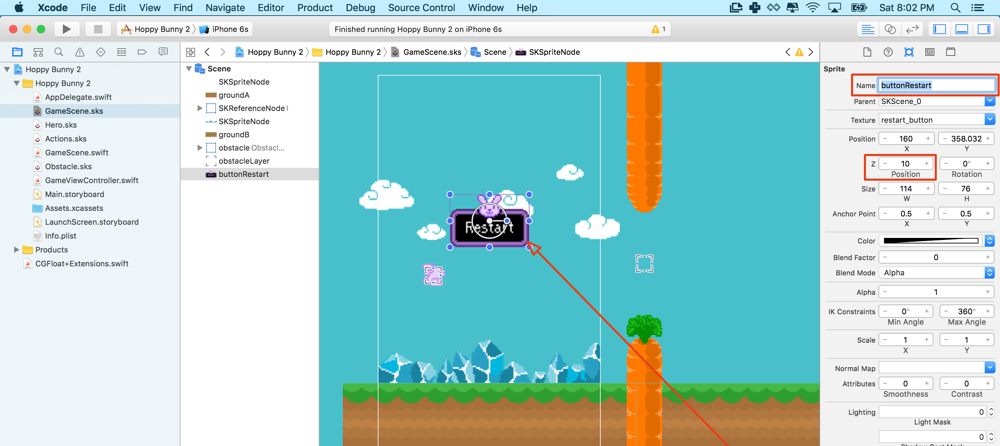

You are going to set up collision handling so that your game finally becomes as frustrating as *Flappy Bird*. Any good game needs to be unforgiving and frustrating, right?

I would recommend you have a look at Apple's own documentation on the subject of [Working with Collisions and Contacts.](https://developer.apple.com/library/ios/documentation/GraphicsAnimation/Conceptual/SpriteKit_PG/Physics/Physics.html#//apple_ref/doc/uid/TP40013043-CH6-SW14) It can be a little bit confusing when you first start, so don't worry if you don't understand
everything at once.

In our setup of collisions we are going to use the *Scene Editor* as much as possible to keep the code as lean as possible, in later tutorials we will expand on physics based collision setup in code.

#Obstacle physics

> [action]
> First, open *Obstacle.sks*, select either carrot.
> Enable physics by changing the *Body Type* to `Bounding rectangle` and untick the subsequent 4 boxes.
>
> 
>
> Next set the *Category Mask* to `2` and the *Contact Mask* to `1`, repeat this for the other carrot.
> Then modify the invisible goal sprite in the middle with one difference, set the *Category Mask* to `8`.
>

Every physics body in a scene can be assigned to up to 32 different categories, each corresponding to a bit in the 32 bit mask.
You notice those really big numbers, they are the integer value of `2` to the power `32` which represents every bit in the 32 bit mask being 1, this also means that that the body will collide with every other body and is the default behavior.

Think about separating your *Categories* into logical groups, for example:

- 1 - Player
- 2 - Obstacle
- 4 - Ground
- 8 - Goal Sensor

The *Contact Mask* allows us to define which physics bodies we want to be told about when a collision takes place.  This will be useful when the bunny hits the carrot, we don't want the bunny to bounce off the carrot we want the bunny to die at this point and fall from the sky.  We are setting the *Contact Mask* to `1` as we will be setting the *Category Mask* of the bunny to `1` very shortly.

The goal is a slightly different case, we want to be informed when the bunny has entered into the goal zone so we can increase our players
score.  However, we don't want the bunny to be physically hit by an invisible force field, we want the bunny to pass through as if nothing is there. We are effectively creating a *Sensor* a type of physics body that is used only for collision detection without physically affecting the body. We will come back to this in more detail soon.

#Bunny physics

> [action]
> Open up our *Hero.sks* and modify the bunny physics properties.
> Set the *Category Mask* to `1`, the *Collision Mask* to `4` and the *Contact Mask* to `4294967295` this is 2^32.
>
> 
>


The *Collision Mask* is set to `7` as we only want to collide with *Categories* `1+2+4`, we don't want to physically collide with `8` which is our goal sensor, otherwise the bunny will never be able to pass through the goal.  The *Contact Mask* has been set to 2^32  the max value and lets the physics engine know we want to be alerted if our bunny collides with any other physics body.

#Ground physics

We need to setup the ground sprite physics, do you think you can tackle this yourself? Check back if you don't remember the *Category Mask* value we decided to use.  What value do you think you'll need for the *Contact Mask?*

> [solution]
> Open up our *GameScene.sks* and modify the ground physics for both sprites.
> Set the *Category Mask* to `4` and the *Contact Mask* to `1`, we want to be informed if the bunny has hit the ground.
> 
>

Run your project, you should now collide with the obstacles yet be able to flap through the middle, if you're good enough :)

#Physics Collision Delegate

If the bunny collides with the ground, the obstacle or passes through the goal, we want to know about.  We will implement the Physics Contact Delegate so our code will be informed whenever one of these collisions takes place.

> [action]
> In *GameScene.swift* you need to declare that the *GameScene* class will implement (some of) the *SKPhysicsContactDelegate* protocol methods. You declare that a class is [implementing a protocol in Swift](https://developer.apple.com/library/ios/documentation/Swift/Conceptual/Swift_Programming_Language/Protocols.html) by appending *CKPhysicsContactDelegate* after the class' super class *SKScene*, separated by a comma, as follows:
>
```
class GameScene: SKScene, SKPhysicsContactDelegate {
```
>

The *GameScene* class is now ready to be used as a contact delegate.

> [action]
> You should assign *GameScene* as the collision delegate class by adding the following line (anywhere) to the `didMoveToView(..)` method:
>
```
/* Set physics contact delegate */
physicsWorld.contactDelegate = self
```

Finally, you can implement the contact handler method that will be called whenever a valid collision contact takes place.

> [action]
> Add this method to the *GameScene* class:
>
```
func didBeginContact(contact: SKPhysicsContact) {
  /* Hero touches anything, game over */
  print("TODO: Add contact code")
}
```
>

Publish and run the app in Xcode. Any time you collide with the ground, carrot or goal sensor the *TODO* message will be printed to the console.

#Implementing "game over"

Instead of only showing a message in the console, you surely want to implement a game over situation:

- Bunny falls to ground
- Scene shakes
- Restart button appears
- Game restarts when restart button is pressed

##Adding a button

There is no easy way to add a button in SpriteKit so we will need to get creative and create our own solution.  To get started
with we have provided a custom class called *MSButtonNode*. Feel free to explore this class, it's well commented.

> [action]
>  and drag this file into your project.

<!-- -->

> [action]
> First, add the `restart_button` from the *Media library* to your scene.
> Next modify the properties of the button, set the *Name* to `buttonRestart` as we will want to create a code connection.
> Set the *Z Position* to `10`, we want to ensure this UI (User Interface) element sits on top of everything visually.
>
> 
>
> To turn this sprite into our custom button, we need to change the class to be an instance of `MSButtonNode` instead of `SKSpriteNode`, we can use the *Custom class* panel to change this:
>
> 
>

Can you setup a code connection for this button?

> [solution]
> Open *GameScene.swift* and add a property for the button to the *GameScene* class.
>
```
/* UI Connections */
var buttonRestart: MSButtonNode!
```
> Next, this is a bit tricker as we need to ensure the node is downcast to our `MSButtonNode` class.
> Add the following to the `didMoveToView(..)` method.
>
```
/* Set UI connections */
buttonRestart = self.childNodeWithName("buttonRestart") as! MSButtonNode
```
>
> This is a restart button and we need to add our own restart function that will then be assigned to the button's `selectionHandler`.
> Add the following after the connection.
>
```
/* Setup restart button selection handler */
buttonRestart.selectedHandler = {

  /* Grab reference to our SpriteKit view */
  let skView = self.view as SKView!

  /* Load Game scene */
  let scene = GameScene(fileNamed:"GameScene") as GameScene!

  /* Ensure correct aspect mode */
  scene.scaleMode = .AspectFill

  /* Restart game scene */
  skView.presentScene(scene)

}
```
> This code simply loads in a fresh copy of the *GameScene.sks*, ensures the correct *scaleMode* is applied and then replaces the current scene with this fresh *GameScene*.

Great button has been connected and will execute the `selectionHandler` code when touched, it would be a good idea to hide it while the bunny is hopping.

> [action]
> Add the following code after the previous connect code:
>
```
/* Hide restart button */
buttonRestart.state = .MSButtonNodeStateHidden
```
>

We want the button to be visible when the bunny dies, let's look at how we implement our game over scenario.
Before you implement this, it would be useful to know the current state of the game.  State management is a great way to do this
, just look at the `MSButtonNode` code above.  We use a `state` to know if the button if `Active,Hidden or Selected`, we could of course add even more states.

For the *GameScene* it would be great to know if the game is `Active or GameOver`, when the `GameOver` state applies we want to:

- Kill the bunny
- Stop the world scrolling
- Show the restart button
- Ignore scene touches

> [action]
> Add the following `enum` to the top of *GameScene.swift*:
>
```
enum GameSceneState {
    case GameSceneStateActive, GameSceneStateGameOver
}
```
>
> To track the state you need to add a `gameState` property to the *GameScene* class. We will set the default to `Active`
>
```
/* Game management */
var gameState: GameSceneState = .GameSceneStateActive
```
>

#Bunny death

Great we now have some basic game management in place, time to kill the bunny!

> [action]
> Replace the `didBeginContact(...)` method as shown:
>
```
func didBeginContact(contact: SKPhysicsContact) {
  /* Hero touches anything, game over */
>
  /* Ensure only called while game running */
  if gameState != .GameSceneStateActive { return }
>
  /* Change game state to game over */
  gameState = .GameSceneStateGameOver
>
  /* Stop any new angular velocity being applied */
  hero.physicsBody?.allowsRotation = false
>
  /* Reset angular velocity */
  hero.physicsBody?.angularVelocity = 0
>
  /* Stop hero flapping animation */
  hero.removeAllActions()
>
  /* Show restart button */
  buttonRestart.state = .MSButtonNodeStateActive
}
```

Notice the check of the current `gameState` to ensure the player only dies once :) The bunnies physicsBody is effectively disabled
by disabling `rotation`, reseting `angularVelocity` and removing the flapping animation with the `removeAllActions()` method.  The button is then activated with a simple state change.

Run your project, when the player dies the button should appear and you can restart play.  
It's not perfect yet as the bunny will still respond every so slightly to touch and the world will continue to scroll by.

> [action]
> To disable scrolling and touch, we can once again use our *gameState* property.
> Add the following to the very top of the `update(...)` method, to exit the update if the game is no longer active and hence
no longer required to update.
>
```
/* Skip game update if game no longer active */
if gameState != .GameSceneStateActive { return }
```
>

<!-- -->

Can you figure out how to disable touch?

> [solution]
> Add the following to the top of the `touchesBegan(...)` method:
>
```
/* Disable touch if game state is not active */
if gameState != .GameSceneStateActive { return }
```

Run the project again, death truly should be final for our bunny.
Great... It would look better if the bunny fell face first upon hitting an obstacle.  A powerful way to do this that
allows us to animate the effect is to use *SKActions*, you've already used actions visually when you setup the flappy animation frames.  You can of course set these up in code...

> [action]
> Add the following code after you stopped the hero's actions with the `removeAllActions()` method in `didBeginContact(...)`:
>
```
/* Create our hero death action */
let heroDeath = SKAction.runBlock({
>
    /* Put our hero face down in the dirt */
    self.hero.zRotation = CGFloat(-90).degreesToRadians()
})
>
/* Run action */
hero.runAction(heroDeath)
```
>

The `runBlock` action lets us define our own action and manually rotate the bunny face down. We need to wrap this in an action to ensure it is executed at the correct step in the rendering loop.  We could *override* the `didSimulatePhysics` step and apply this manually rotation however it's kind of awkward, much easier to wrap in an *SKAction*.

Run the project, the bunny should be face down now upon any collision. It's all those little extra details...

#Shake it

It would be nice to add an old school style Star Trek camera shake.  This time we will create our own *GameEffects.sks* SpriteKit action file, this enables us to create multiple effects that can then be reused and executed on any node.

> [action]
> Create a new *SpriteKit Action* file called `GameEffects`:
>
> 
> 
>
> Time for you to add your first *Action* let's call it `Shake`
> 
>
> Now you have an empty action timeline ready for some actions, drag across the *Move action* from the *Object Library* then reduce
> the duration to `0.2` seconds.
>
> 
>
> Sadly in Xcode 7.2 it does not yet seem possible to preview this action on the scene from within the editor :(
>
> Copy and paste this action twice more and then modify the values as follows, although as always feel free to experiment.
> *Timing Function*: `Ease In`, *Offset*: `(8,2)`
> *Timing Function*: `Ease Out`, *Offset*: `(-4,-2)`
> *Timing Function*: `Ease Out`, *Offset*: `(4,2)`

Time to try this out in our code, you don't need to worry about loading the file, SpriteKit will automatically load any SpriteKit related resources and caches them at runtime.

> [action]
> Open *GameScene.swift* and add the following after running the death action on our bunny.
>
```
/* Load our shake action resource */
let shakeScene:SKAction = SKAction.init(named: "Shake")!
>  
  /* Loop through all nodes  */
  for node in self.children {
>      
      /* Apply effect each ground node */
      node.runAction(shakeScene)
  }
```
> Unfortunately the effect does not work if applied directly to the *GameScene* so we need to loop through all the child nodes in our
scene and apply to them all individually.  Thankfully it is straightforward to do so.

Run the project, when the bunny dies the screen should give a short shake. I encourage you to make this effect as crazy as you like,
experimentation is the best way to see what works.  Often the little accidents lead us onto something awesome.

You may have noticed the game is a little tricky, perhaps too tricky.  It feels like the bunny falls too hard initially and applying the touch impulse doesn't feel quite right.

> [action]
> Open *Hero.sks*, click on the bunny and navigate down to the physics properties, notice the *Initial Velocity* properties.  Let's make a change here to the vertical velocity, set it to `400`.  This should give the player a little more reaction time when the game first starts.
> 
>

When the bunny is falling and the player touches the screen, it feels a little sluggish.  This is due to the cumulative downward velocity generated by the bunny's fall.  If we reset the vertical velocity at the point of touch this might make it feel more responsive.

> [action]
> Open *GameScene.swift*, navigate to the `touchesBegan(...)` method and add the following after the `gameState` check:
>
```
/* Reset velocity, helps improve response against cumulative falling velocity */
hero.physicsBody?.velocity = CGVectorMake(0, 0)
```

Run the project... That little change has made the core mechanic feel much more satisfying.  Good job.

> [info]
> Little tip, you've added a lot of code and your formatting may be getting a little ugly.  Thankfully there is an easy way to reformat your code.
> Open *GameScene.swift* then press *Cmd+a* to select all your code then press *Ctrl+i* to Re-Indent.

#Summary

Wow, a lot of ground has been covered here:

- Understanding the basics of SpriteKit physics collision and contact masking
- Implementing the `SKPhysicsContactDelegate` so you know when the bunny has been hit
- Creating your own custom button class
- Implementing a simple game state manager
- Running a custom *SKAction* and creating reusable *SKActions* visually
- Tweaking core mechanics, making the gameplay feel just right.

Next up, it wouldn't be a game without a scoring mechanism.
