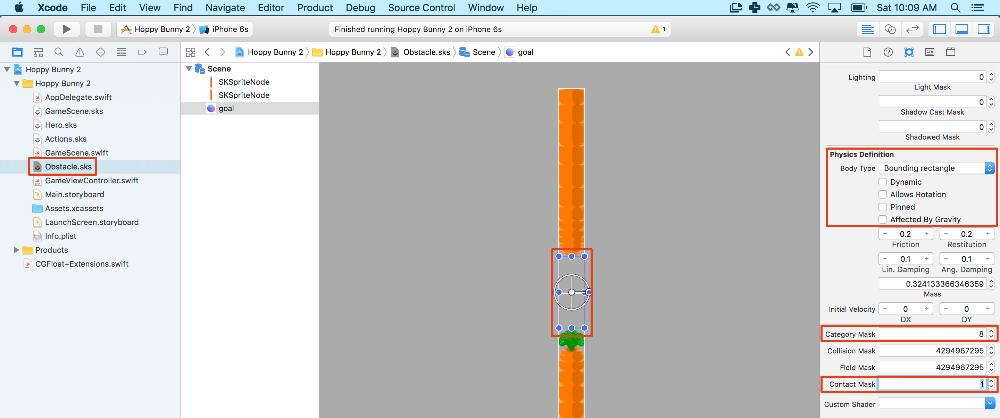
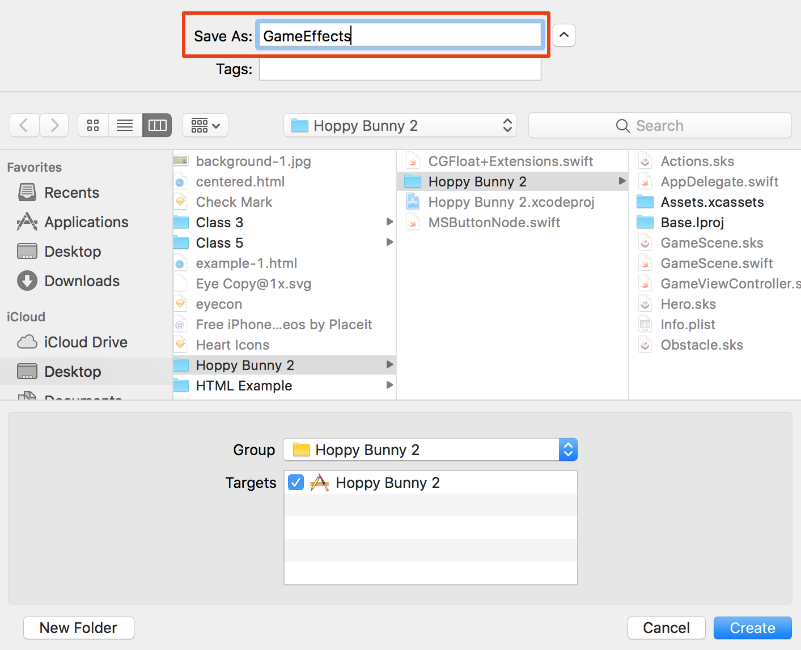

You are going to set up collision handling so that your game finally becomes a
real game! At the moment the player passes through obstacles and lands on the
ground. To make the game challenging the player will have to avoid the obstacles
by maneuvering through the space between the carrots and avoid hitting the
ground!

In this tutorial you will setup physics collisions and contacts in the scene
editor, in later tutorials you will expand this knowledge implementing physics
setup in code.

# Quick overview of physics

SpriteKit has a high performance physics engine built in. It allows you to
create games with objects that collide, bounce, and move like objects in the
real world. The physics engine does this by assigning properties to objects like
velocity, friction, elasticity, and more.

Imagine a game with players, missiles, platforms, and enemies. Missiles might
explode when they hit an enemy. Players and enemies might bounce off platforms
and each other. Player objects might move as if they were soft and rubbery while
enemies seem heavy and solid.

Physics objects have few properties that determine how they interact with each
other, these are:

- Category Bit Mask
- Contact Bit Mask
- Collision Bit Mask

## Category bit mask

This value identifies which category a physics object belongs to. You will
assign each object a category so the physics engine can assign the appropriate
interactions.

## Contact Bit Mask

The contact bit mask determines which category an object produces contact events
for. It's important to understand that contact events **do not produce a
physical collision!**. In other words a contact only tells you that two objects
made contact. Objects that make contact might bounce or might pass through one
another. How they interact is determined by the _Collision Bit Mask_.

## Collision Bit Mask

The collision bit mask determines which **category** of objects a physics object
collides with. A collision is a physical interaction. When an object collides
with another object it there is a physical effect! For example one object may
bounce off the other or knock the other object over (Think about Angry Birds).

# Physics Categories values

Physics categories are read as binary values with a value of 2 to the power
of 32. So 0 would look like:

`00000000000000000000000000000000`

The value 1 would translate to:

`00000000000000000000000000000001`

A value of 2 would be:

`00000000000000000000000000000010`

Remember that binary values only contain 1s and 0s! Think back to your CS
classes!

Contact, and Collision Bit masks use the same values. The physics engine
compares all three values to determine which objects will collide and which
contacts it should tell you about.

When the _category_ value of an object has a 1 in the same position as the value
for _collision_, then the objects collide. The same is true for contacts. For
example, objects of category:

`00000000000000000000000000000010`

Will collide with objects whose have a collision bitmask of:

`00000000000000000000000000000011` _(both have a 1 in the second column)_

This object would also collide with objects whose category is:

`00000000000000000000000000000001` _(shares a 1 in the first column)_

Let's apply this idea to the game. So far you have the following types of
objects:

- Player
- Obstacle
- Ground
- Goal Sensor

Let's give them each a unique binary value. They each need a value with a 1 in a
different column from the others this identifies each as a different type (or
category) of object.

- `00000001` = 1 = Player
- `00000010` = 2 = Obstacle
- `00000100` = 4 = Ground
- `00001000` = 8 = Goal Sensor

These are each unique categories because they each have a 1 in a unique column.
In the scene editor you will enter the integer value for the binary number
(`00000100` = 4).

# Collision Bit Masks

When you set the collision bit mask you are deciding which objects will produce
a physical collision. In your game you want the bunny/hero (1) to collide with
the carrots/obstacle (2) and the ground (4). So the Collision Bit Mask for the
player is 7.

- `00000001` = 1 = Player
- `00000010` = 2 = Obstacle
- `00000100` = 4 = Ground
- `00000111` = 7 = **Player Collision Bit Mask**
- `00001000` = 8 = Goal (doesn't collide with Player)

Notice that 1+2+4 = 7. Also notice that in binary the number 7 shares a 1 in the
same columns as Player, Obstacle, and Ground.

You don't want the player (1) to collide with goal (8)! Notice the goal Category
Bit Mask in binary doesn't share a 1 in any of the columns with the _Player
Collision Bit Mask_.

# Contact Bit Masks

A contact doesn't produce a physical interaction but it is noticed by the
physics engine. You want to know when the player (1) makes contact with the goal
(8) because this will score a point. You also want to know when the player hits
obstacles (2) or the ground (4) because this ends the game.

- `0010` = 2 Obstacles
- `0100` = 4 Ground
- `1000` = 8 Goal
- `1110` = 14 **Contact Bit Mask for player**

Contact for player is 2+4+8 = 14.

Any binary value with `1110` would work here. For example `15` (`1111`), or even
`4294967295` which is:

`11111111111111111111111111111111` = 2^32 = 4294967295. You may have noticed
this is the default value in the editor. These default settings are why the
bunny collides with the ground currently.

# Setup physics

Now that we understand what needs to be done, let's go ahead and implement it!

Currently the obstacles don't use physics. You will apply physics in the next
step:

> [action] Open `Obstacle.sks`, make the following changes to both **carrots**:.
>
> - Enable physics by setting the _Body Type_ to `Bounding rectangle`.
>   **Uncheck** the 4 boxes that appear below.
>
> 
>
> - Set the _Category Mask_ to `2` (obstacle category) and the _Contact Mask_ to
>   `1` (player category).
>
> With these settings obstacles should collide with players.
>
> _Be sure to apply these steps to both carrots!_

<!--  -->

> [action] Select the invisible **goal** object. Choose `Bounding Rectangle` as
> the _Body Type_. Uncheck the 4 boxes that appear below.
>
> - Set the _Category Mask_ to `8` and the _Contact Mask_ to `1`.
>
> 
>
> Goal objects are category 8, and contact Players (category 1).

# Bunny physics

> [action] Open `Hero.sks` and click on the **bunny**. The Body Type should be
> `Bounding Circle`. Below this set _Category Mask_ to `1`, _Collision Mask_ to
> `7` and the _Contact Mask_ to `15` (or `4294967295` this is 2^32 if you
> prefer).
>
> 

# Ground physics

You need to setup the ground sprite physics, do you think you can tackle this
yourself? Check back if you don't remember the _Category Mask_ value we decided
to use. What value do you think you'll need for the _Contact Mask?_

> [solution]
>
> Open `GameScene.sks` and modify both **ground** sprites. The _Body
> Type_ should be `Bounding Rectangle`, and the four boxes below should
> unchecked.  
> Set _Category Mask_ to `4` and _Contact Mask_ to `1`, you want to be informed
> if the bunny has hit the ground.
>
> 

Run your game. The bunny will now collide with the obstacles yet thankfully be
able to flap through the goal gap. Well if you're good enough :]

Currently the bunny will get pushed off the screen if you collide with a carrot.
Don't worry about this it's a physics interaction that you set up. You will be
taking care of this in a later step. For now just restart the simulator and try
again.

# Physics Contact Delegate

If the bunny collides with the ground, an obstacle, or passes through the goal
of an obstacle, you want to know about it. Next you will implement the _Physics
Contact Delegate_ so your code will be informed whenever one of these collision
contacts takes place.

Remember earlier when you set the _Contact Bit Mask_? Here you informed the
physics system which contacts you were interested in, and through the contact
delegate you will be informed when they occur.

> [action] Open `GameScene.swift`. You need to declare that the `GameScene`
> class will implement the `SKPhysicsContactDelegate` protocol methods.
>
> You declare that a class is implementing this protocol in Swift by appending
> `SKPhysicsContactDelegate` after the class' super class `SKScene`, separated
> by a comma, as shown:
>
```
class GameScene: SKScene, SKPhysicsContactDelegate {
```

## Delegate Support

The `GameScene` class is now ready to implement the contact delegate, first you
should inform the delegate which class will take responsibility for handling the
messages. You should assign `GameScene` as the collision delegate.

> [action] In `GameScene.swift`, add the following code to the
> `didMove(to view:)` method:
>
```
/* Set physics contact delegate */
physicsWorld.contactDelegate = self
```

Finally, you can implement the `didBegin(_ contact:)` method that will be called
whenever a collision takes place that you want to know about e.g. The ones with
a _contactMask_ of `1`.

> [action] In `GameScene.swift`, add this new method to the `GameScene` class:
>
```
func didBegin(_ contact: SKPhysicsContact) {
  /* Hero touches anything, game over */
  print("TODO: Add contact code")
}
```

Run the game. Any time you collide with the ground, a carrot or a goal sensor
the _TODO_ message will be logged to the console.

# Game over

Instead of simply showing a message in the console, it would be nice to think
about the game over scenario.

This might consist of:

- The bunny falling to ground
- The game Scene shakes
- A restart game button

## Adding a button

There is no pre-made button object in SpriteKit so you will need to get creative
and create your own solution. To help we've provided a starting point for you
with a custom class called _MSButtonNode_.

> [action][download msbuttonnode.swift](https://github.com/MakeSchool-Tutorials/Hoppy-Bunny-SpriteKit-Swift3-V2/raw/master/MSButtonNode.swift)
> and drag this file into your project.

<!-- -->

> [action] Add the `restart_button.png` to your scene by opening the media
> _Media Library_ (you know what to do: `+`) and dragging it into
> `GameScene.sks`. Make sure you drag it within the boundaries of the scene.
>
> Set the _Name_ to `buttonRestart`, set the _Z Position_ to `10`, you want to
> ensure this UI (User Interface) element sits on top of everything visually.
>
> 
>
> To turn this sprite into a custom button, you need to change the class to be
> an instance of `MSButtonNode` instead of `SKSpriteNode`, you can use the
> _Custom class_ panel to change this by setting the _Custom Class_ to
> `MSButtonNode`
>
> 

Can you setup a code connection for this button?

> [solution]
>
> Open `GameScene.swift`, add a property for the button to the
> `GameScene` class at the top near all the other `var` declarations:
>
```
/* UI Connections */
var buttonRestart: MSButtonNode!
```
>
> When you connect this node you need to ensure the node is downcast to the
> `MSButtonNode` class. Add the following to the `didMove(to view:)` method.
>
```
/* Set UI connections */
buttonRestart = (self.childNode(withName: "buttonRestart") as! MSButtonNode)
```

## Selection handler

The code connection is ready, if you run the game you can touch the button, it
looks like it was touched yet nothing happens. You need to add some code to be
executed upon user touch.

> [action]
>
> In `GameScene.swift`, add the following code after the code
> connection (still in `didMove(to view:)`):
>
```
/* Setup restart button selection handler */
buttonRestart.selectedHandler = {
>
  /* Grab reference to our SpriteKit view */
  let skView = self.view as SKView?
>
  /* Load Game scene */
  let scene = GameScene(fileNamed:"GameScene") as GameScene?
>
  /* Ensure correct aspect mode */
  scene?.scaleMode = .aspectFill
>
  /* Restart game scene */
  skView?.presentScene(scene)
>
}
```

This code loads in a fresh copy of the `GameScene.sks`, ensures the correct
_scaleMode_ is applied and then replaces the current scene with this fresh
_GameScene_. This same code is used in `GameViewController.swift` to initially
load _GameScene_ when the game starts.

You should now be able to run the game. If the bunny gets knocked off the screen
tap restart and the bunny is back and the game restarts!

## Hide the button

Great you have a button, might be an idea to hide it once the game is in-play.

> [action] Add the following code after the selection handler setup (at the
> bottom of `didMove(to view:)`).
>
```
/* Hide restart button */
buttonRestart.state = .MSButtonNodeStateHidden
```

You want the button to be visible when the bunny dies, let's look at how we
implement our game over scenario.

It would be really useful to know the current state of the game. Has the game
started, is the player dead etc?

# Game State

State management is a great way to do this, take a look at `MSButtonNode.swift`.
A `state` property is used to track if the button is
`Active,Hidden or Selected`.

For the _GameScene_ class it would be great to know if the game state is either
`Active` or `GameOver`.

When this `GameOver` state applies you want to:

- Kill the bunny :(
- Stop the world scrolling
- Show the restart button
- Ignore any touch other than the button

An `Enumeration` is a great way to setup a custom state type.

> [action] Add the following `Enumeration` to the top of `GameScene.swift`
> (Outside of the GameScene class):
>
```
enum GameSceneState {
    case active, gameOver
}
```
>
> To track the state you need to add a `gameState` property to the `GameScene`
> class. Declare this where your other `var` declarations are at. Set the
> default to `Active`
>
```
/* Game management */
var gameState: GameSceneState = .active
```

# Bunny death

Great you now have some rudimentary game management in place, time to kill the
bunny (we're sad too)

> [action] Replace the `didBegin(_ contact:)` method with the following code:
>
```
func didBegin(_ contact: SKPhysicsContact) {
  /* Hero touches anything, game over */
>
  /* Ensure only called while game running */
  if gameState != .active { return }
>
  /* Change game state to game over */
  gameState = .gameOver
>
  /* Stop any new angular velocity being applied */
  hero.physicsBody?.allowsRotation = false
>
  /* Reset angular velocity */
  hero.physicsBody?.angularVelocity = 0
>
  /* Stop hero flapping animation */
  hero.removeAllActions()
>
  /* Show restart button */
  buttonRestart.state = .MSButtonNodeStateActive
}
```

Notice the check of the **gameState** to ensure that the code will not be called
more than once, when the player has died. The bunnies physics are effectively
disabled by stopping `rotation`, reseting `angularVelocity` and removing the
flapping a sprite frame animation with the use of `removeAllActions()` method.
The button is then activated and presented to the player with a simple
`MSButtonNodeStateActive` state change.

Run the game. When the player dies the button should appear and you can restart
play. **NOTE!** for now hitting anything, including the goal, will end the game.
For the next few steps the bunny will NOT be able to pass through the goal! You
will take care of this when you set up scoring in section 8.

# Shutting down the world

It's not perfect yet as the bunny will still respond ever so slightly to touch
and the world will continue to scroll by.

To disable scrolling and touch, you can once again make use of the _gameState_
property.

> [action] In `GameScene.swift`, add the following to the very top of the
> `update(...)` method:
>
```
/* Skip game update if game no longer active */
if gameState != .active { return }
```

Can you figure out how to disable touch?

> [solution]
>
> In `GameScene.swift`, add the following to the top of the
> `touchesBegan(...)` method:
>
```
/* Disable touch if game state is not active */
if gameState != .active { return }
```

Run the game. Death truly should be final for our bunny. In these last two code
snippets the if statement checks the value of gameState, if the value is .active
`return` ends the function. In this case all of subsequent code is _not_ run.

# Death actions

It would look more realistic (although sadder) if the bunny fell face first upon
hitting an obstacle. A powerful way to do achieve this is using _SKActions_,
you've already used actions to setup the the flappy animation frames.

> [action] In `GameScene.swift`, add the following code after you stopped the
> hero's actions with the `removeAllActions()` method in `didBegin(...)`:
>
```
/* Create our hero death action */
let heroDeath = SKAction.run({
>
    /* Put our hero face down in the dirt */
    self.hero.zRotation = CGFloat(-90).degreesToRadians()
})
>
/* Run action */
hero.run(heroDeath)
```

The `runBlock` action lets you define your own custom action and in this case,
manually rotate the bunny face down. With actions you can animate sprites, plays
sounds, and more. Actions are a versatile and flexible tool.

Run the game. The bunny should be face down now upon any collision. It's all
about those little bits of polish :]

# Shake it

It would be nice to add an action movie camera shake to emphasize the impact.
This time you will create your own `GameEffects.sks` **SpriteKit Action file**,
this enables you to store multiple effects that can be reused on any node.

> [action] Create a new _SpriteKit Action_ file called `GameEffects`:
>
> 
>
> 
>
> Add your first _Action_, name it `Shake` >
> 
>
> Now you have an empty action timeline ready for some actions, drag across the
> _Move action_ from the _Object Library_.
>
>  Set the
> _Duration_ to `0.2` seconds. Copy and paste this action two times and then
> modify all three actions as follows.
>
> - _Move Action 1:_ Set _Timing Function_ to `Ease In`, set _Offset_ to
>   `(8,2)` > 
>
> - _Move Action 2:_ Set _Timing Function_ to `Ease Out`, set _Offset_ to
>   `(-4,-2)` > 
>
> - _Move Action 3:_ Set _Timing Function_ to `Ease Out`, set _Offset_ to
>   `(4,2)` > 

## Shake all the nodes

Time to apply this action to your scene.

> [action] Open _GameScene.swift_ and add the following code after the death
> action (in `didBegin()`).
>
```
/* Load the shake action resource */
let shakeScene:SKAction = SKAction.init(named: "Shake")!
>
/* Loop through all nodes  */
for node in self.children {
>
    /* Apply effect each ground node */
    node.run(shakeScene)
}
```
>
> The effect can not be applied directly to the _GameScene_, so you need to loop
> through all the child nodes in the scene and apply them individually.
> Thankfully it is straight forward to do so.

Run the game. When the bunny dies the screen should give a short shake.

> [info]
>
> I encourage you to make this effect as crazy as you like,
> experimentation is the best way to learn what works. Often it's the happy
> little accidents lead you onto something awesome.

# Physics tweaking

You may have noticed the game is a little difficult, perhaps too difficult. It
feels like the bunny falls too hard initially and applying the touch impulse
doesn't feel quite right.

> [action] Open `Hero.sks`, click on the bunny and navigate down to the physics
> properties, notice the _Initial Velocity_ property.
>
> Set Initial Velocity to `(dx: 0, dy: 400)`. This should give the player a much
> need reaction time cushion when the game first runs.
>
> 

When the bunny is falling and the player touches the screen, the touch feels a
little sluggish. This is due to the cumulative downward velocity generated by
the bunny's fall. If you reset the vertical velocity at the point of touch this
might make it feel more responsive.

> [action] Open `GameScene.swift`, add the following in the `touchesBegan(...)`
> method after the `if gameState..` check:
>
```
/* Reset velocity, helps improve response against cumulative falling velocity */
hero.physicsBody?.velocity = CGVector(dx: 0, dy: 0)
```

Run the game. That little change has made the core mechanic feel much more
satisfying :]

> [info] Bonus tip for making it so far: You've added a lot of code and your
> formatting may be getting a little, well ugly.  
> Thankfully there is an easy way to tidy up your code with _Re-Indent_ Open
> `GameScene.swift` then select all your code with _Cmd+a_, then press _Ctrl+i_
> to Re-Indent.

So far the Bunny moves and the game play is almost complete. At this point the
game ends if the Bunny hist _anything_ which includes the **goal**! You will
take care of this last detail in the next section when implement the score. You
also may see the bunny get bounced off the screen when it hits something. You
will take care of this later also.

# Summary

Wow, a lot of ground has been covered in this chapter:

- Understanding the principles of SpriteKit physics collision and contact
  masking
- Implementing the `SKPhysicsContactDelegate` so you are informed of collision
  contacts.
- Creating your own custom button class
- Implementing a simple game state manager
- Running a custom _SKAction_ and creating reusable _SKActions_ visually
- Tweaking core mechanics, making the gameplay feel just right.

Next up, it wouldn't be a game without a scoring mechanism for the player.
