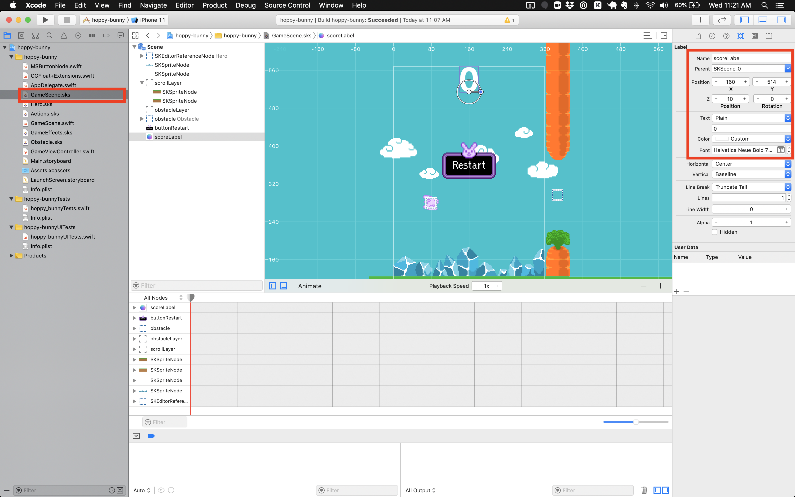

There is one thing missing, the player's score! It's not much fun dodging
obstacles without any reward.

# Adding the score label

> [action] Drag a _Label_ object from the Object Library into the
> `GameScene.sks`, set the _Name_ to `scoreLabel` and set the font to something
> you like and will also be easy for the player to read. You could try
> `Helvetica Neue, Bold, 72`. Set the _Z Position_ to `10` as you want to ensure
> it's always in the foreground.
>
> 
>
> Position it somewhere clear and easy to read, near top of the screen is good.

<!-- -->

> [info] If you are having difficulty moving the _scoreLabel_ or just want finer
> control over node placement in general. You can use the _Arrow Keys_ to move
> any node a pixel at a time or hold _Shift + Arrow Keys_ to move in a bigger
> step.

Can you add a code connection in _GameScene.swift_ for `scoreLabel`? **Tip: The
node type will be SKLabel**

> [solution] Open `GameScene.swift` and add the following property near the top
> of the `GameScene` class:

```
var scoreLabel: SKLabelNode!
```

> Add the following code after the `buttonRestart` connection:

```
scoreLabel = (self.childNode(withName: "scoreLabel") as! SKLabelNode)
```

>

Great the connection has been made, if you did it yourself, virtual high five!

## Tracking score

The _scoreLabel_ will display game score. However, as it stands there is no way
to track this, let's add a score counter.

> [action] Open `GameScene.swift` and add the following property to the
> _GameScene_ class:

```
var points = 0
```

When the game starts you want to ensure the label is reset to `0`, let's make
that happen.

> [action] In `GameScene.swift`, add the following code to the bottom of the
> `didMove(to view:)` method:

```
/* Reset Score label */
scoreLabel.text = "\(points)"
```

> `scorLabel.text` expects a string `points` is an Int, wrapping points in "\()"
> converts it into a string.

So far if the bunny collides with anything it will trigger the death sequence.
When there is a collision with the goal you want to score a point instead of
ending the game. When a collision occurs you need some way of knowing if this
was a collision between the **bunny** and the **goal**, if it's a collision with
anything else the game is over.

The `didBegin(_ contact:)` method provides `contact` with an `SKPhysicsContact`
object. This object contains two properties: `bodyA` and `bodyB` which represent
the two objects that just made contact with each other. In this next step you
will check them both and if one is the player and the other the goal you will
add 1 to `points` and ignore the rest of code that ends the game.

> [action] Open `GameScene.swift` and add this code to the **start** of the
> `didBegin(...)` method, **before** the `gameState` check.

```
/* Get references to bodies involved in collision */
let contactA = contact.bodyA
let contactB = contact.bodyB
>
/* Get references to the physics body parent nodes */
let nodeA = contactA.node!
let nodeB = contactB.node!
>
/* Did our hero pass through the 'goal'? */
if nodeA.name == "goal" || nodeB.name == "goal" {
>
  /* Increment points */
  points += 1
>
  /* Update score label */
  scoreLabel.text = String(points)
>
  /* We can return now */
  return
}
```

When a collision takes place between two bodies the information is stored in a
`SKPhysicsContact` object. You can use this to find out more information about
the collision, so first you grab a reference to the `SKPhysicsContact`. However,
you may have a custom class with your own properties and want to access those,
so you go up a level and get a reference to the parent node this body belongs.

With the reference to `SKPhysicsContact` node you can check for the _Name_ of
`goal`. You can then update the players _points_ and use that to update the
**score label**. After that you _`return`_ from the `didBegin(...)` method,
otherwise the game would end. Important! a function ends when it hits a return
statement!

Run the game. With a bit of skill you should be able to pass through the goal
and get a point. You can always make the goal area bigger for testing :]

# Feedback and Review - 2 minutes

**We promise this won't take longer than 2 minutes!**

Please take a moment to rate your understanding of the learning outcomes from
this tutorial, and how we can improve it via our
[tutorial feedback form](https://forms.gle/foNx7mRZhL92uRPN7)

This allows us to get feedback on how well the students are grasping the
learning outcomes, and tells us where we can improve the tutorial experience.

# Summary

**Congratulations on finishing \*Hoppy Bunny!**

In this chapter you learned to:

- Adding a _SKLabel_
- Manage the player score
- Identifying specific physics collisions

The next chapter will be a recap of everything you have covered so far, as well
as stretch challenges if you want to keep building out this game. Well done
building your new game!
