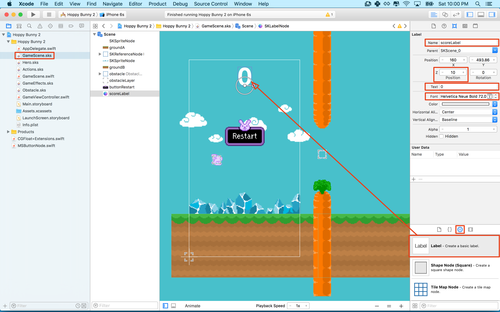

There is one thing missing, the player's score! It's not much fun dodging obstacles without any reward.

#Adding the score label

> [action]
> Drag a *Label* object into the *GameScene.sks*, set the *Name* to `scoreLabel` and set the font to something you like and will also be easy for the player to read.
> You could try `Helvetica Neue, Bold, 72`. Set the *Z Position* to `10` as you want to ensure it's always in the foreground.
>
> 
>
> Position it somewhere clear and easy to read, near top of the screen is good.
>

<!-- -->

> [info]
> If you are having difficulty moving the *scoreLabel* or just want finer control over node placement in general.
> You can use the *Arrow Keys* to move any node a pixel at a time or hold *Shift + Arrow Keys* to move in a bigger step.
>

Can you add a code connection in *GameScene.swift* for `scoreLabel`?
**Tip: The node type will be SKLabel**

> [solution]
> Open *GameScene.swift* and add the following property:
>
```
var scoreLabel: SKLabelNode!
```
>
> Add the following code after the `buttonRestart` connection:
>
```
scoreLabel = self.childNode(withName: "scoreLabel") as! SKLabelNode
```
>

Great the connection has been made, if you did it yourself, virtual high five.

##Tracking score

The *scoreLabel* will display game score.  However, as it stands there is no way to track this, let's add a score counter.

> [action]
> Open *GameScene.swift* is open and add the following property to the *GameScene* class:
>
```
var points = 0
```
>

When the game starts you want to ensure the label is reset to `0`, let's make that happen.

> [action]
> Add the following code to the bottom of the `didMove(to view:)` method:
>
```
/* Reset Score label */
scoreLabel.text = "\(points)"
```
>
> `scorLabel.text` expects a string `points` is an Int, wrapping points in "\()" converts it into a string.  

So far if the bunny collides with anything it will trigger the death sequence. When there is a collision with the goal you want to score a point instead of ending the game. When a collision occurs you need some way of knowing if this was a collision between the **bunny** and the **goal**, it it's a collision with anything else the game is over. 

The `didBegin(_ contact:)` method provides `contact` which an `SKPhysicsContact` object. This object contains two properties: `bodyA` and `bodyB` which represent the two objects that just made contact with each other. In this next step you will check them both and if one is the player and the other the goal you will add 1 to `points` and ignore the rest of code that ends the game.  

> [action]
> Open *GameScene.swift* and add this code to the *start* of the `didBeginContact(...)` method, *before* the `gameState` check.
>
```
/* Get references to bodies involved in collision */
let contactA = contact.bodyA
let contactB = contact.bodyB
>
/* Get references to the physics body parent nodes */
let nodeA = contactA.node!
let nodeB = contactB.node!
>
/* Did our hero pass through the 'goal'? */
if nodeA.name == "goal" || nodeB.name == "goal" {
>    
  /* Increment points */
  points += 1
>  
  /* Update score label */
  scoreLabel.text = String(points)
>  
  /* We can return now */
  return
}
```

When a collision takes place between two bodies the information is stored in a *SKPhysicsContact* object.  You can use this to find out more information about the collision, so first you grab a reference to the *SKPhysicsBodies*.  However, you may have a custom class with your own properties and want to access those, so you go up a level and get a reference to the parent node this body belongs.

With the reference to *SKSpriteNode* node you can check for the *Name* of `goal`. You can then update the players *points* and use that to update the **score label**.  After that you *`return`* from the `didBeginContact(...)` method, otherwise the game would end. Important! a function ends when it hits a return statement!

Run the game... With a bit of skill you should be able to pass through the goal and get a point. You can always make the goal area bigger for testing :]

#Challenges

Now that you have gotten through the entire tutorial don't stop here! You can still modify the game to make it play better. You can change the art to make it more interesting and unique. Challenge your skills by trying some of the ideas here:

- Make the clouds and crystals scroll past like the ground. 
    - Adjust the speeds of each of these to make the effect look pleasing. 
- Add a sound each time the bunny makes it through the goal. 
- Change the art. Change the whole theme of the game by adding new art. 
- Modify game play. There are many variables used in the game that can be changed. 
    - The physics properties of the bunny. This will chnage the feel of the game and how it plays.
    - The speed of obstacles and how often they are created. This will change the pace of the game.
    - The vertical position of obstacles on the screen. This will change the dificulty. 
    - The size of the goal area. This will also change the difficulty. 
- Add different types of obstacles.
    - Having different types of obstacles will keep the game interesting. 
- Add coins or prizes that can be picked up. 

#Summary

Congratulations on finishing *Hoppy Bunny*, give the person next to you a high five.

In this chapter you learned to:

- Adding a *SKLabel*
- Manage the player score
- Identifying specific physics collisions

The next chapter will be a recap of everything you have covered so far, well done.
